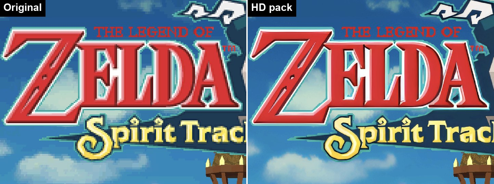

# Watermelon Thor

An experimental dual-screen Android fork of [melonDS](https://melonds.kuribo64.net/) tuned for the
AYN Thor, with HD texture pack support, per-layer upscaling filters, and core fixes that upstream
doesn't have yet.

Based on [WatermelonDS](https://github.com/SapphireRhodonite/WatermelonDS) (formerly melonDualDS) by
SapphireRhodonite, itself built on [rafaelvcaetano's melonDS Android port](https://github.com/rafaelvcaetano/melonDS-android).
Currently synced to WatermelonDS **0.7.0**.

**HD packs:** [Games with HD pack recipes](tools/hd_remaster/games/GAMES.md) · [Recipes and how
to add a game](tools/hd_remaster/games/README.md) · [The remastering tool](tools/hd_remaster/README.md) ·
[AI portrait redraws](tools/hd_remaster/REDRAW.md)

"Experimental" is meant literally: this fork exists to try renderer ideas on one specific handheld.
Expect rough edges on anything that isn't a Thor.

## How it differs from WatermelonDS

Everything WatermelonDS 0.7.0 has is here: the Vulkan renderer and FastPath, dual-screen and
external display support, RetroAchievements, RetroArch shader presets. On top of that:

| Area | WatermelonDS 0.7.0 | Watermelon Thor |
| --- | --- | --- |
| Target device | Any Android device | Tuned and tested on the AYN Thor (Snapdragon 8 Gen 2, two panels) |
| HD texture packs | — | Dump and replace 3D textures, 2D sprites and BG tiles |
| HD remastering | — | Build an AI-upscaled pack for a whole game straight from its ROM, no playthrough needed |
| HD text | — | Text the game draws at runtime is redrawn from an upscaled copy of its own font |
| AI redraws | — | Character portraits redrawn by an image model from the official art, checked against the game's faces ([guide](tools/hd_remaster/REDRAW.md)) |
| Upscaling | Full-screen RetroArch shaders | Also per-layer filters for 3D, sprites and BG separately (ScaleFX, Anime4K, HQ2x, ...) with a disk cache |
| In-game overlay | Pause menu | Adds a turbo speed picker, live texture-filter switching, and "stretch to fit both screens" |
| Input | Single-button hotkeys | Adds modifier combos, so a hotkey can sit behind a chord; an unassigned stick click no longer washes out the top screen |
| Cheats | Starts with an empty database | Ships a cheat database, imported on first launch |
| Dual-screen rendering | Dual-screen presets and layouts | Adds fixes for flicker, stale lines and wrong-screen content on alternating dual-3D scenes, in both the Compatibility and FastPath profiles |
| CPU / JIT | melonDS core as of Nov 2025 | ARM64 JIT fixes and speedups (see below) |
| Saves and audio | — | Crash-safe save writes; changing the volume in-game (including from 0) keeps the sound playing |
| RetroAchievements | Keep-alive ping blocks the emulator for the network round trip every two minutes | Ping is sent off the emulator thread, so it no longer causes periodic hitches |
| Install | Application ID `me.magnum.melondualds` | Own application ID `app.watermelonthor`, so it installs alongside WatermelonDS and melonDS; its settings files in shared folders have their own names (`WatermelonThor.opts`, `<game>.thor.opts`) |
| Updates | In-app updater that downloads WatermelonDS releases from GitHub | No in-app updater: new builds are installed by hand |

**Install note:** this fork has its own application ID, `app.watermelonthor` (`.dev` for debug
builds, `.nightly` for nightly builds), so it installs **alongside** WatermelonDS and melonDS
instead of replacing them. Each app keeps its own settings and internal data (such as HD packs
and the filter cache). Builds from before the ID change used WatermelonDS's ID
(`me.magnum.melondualds`) and installed over it; the new ID does not pick up their data.

This repository is self-contained: the emulator core (`melonDS-android-lib/`, derived from the
[melonDS](https://github.com/melonDS-emu/melonDS) core) is part of the tree, with no core submodule.

## What this fork adds

### HD remastering from the ROM
Making an HD pack used to mean playing the whole game with texture dumping on, then upscaling
whatever got dumped. [`tools/hd_remaster`](tools/hd_remaster/README.md) skips the playthrough:

```
powershell -ExecutionPolicy Bypass -File tools\hd_remaster\remaster.ps1 game.nds -Push
```

Games with a [recipe](tools/hd_remaster/games/README.md) get the settings and game-specific
rules that were verified for them, so anyone with the same ROM gets the same pack. **[The HD
games list](tools/hd_remaster/games/GAMES.md)** has every one - Lufia: Curse of the Sinistrals,
Phantom Hourglass, Spirit Tracks, Nostalgia and Chrono Trigger so far - with before/after
screenshots, pack sizes, build times and what each pack covers, plus the games wanted next.



It decodes every 3D texture, sprite and background in the ROM exactly as the emulator does,
names each one by the key the emulator looks it up by, upscales them with an AI model
(4x-UltraSharp by default) on an NVIDIA GPU, and installs the pack over adb. Sprites and
backgrounds are upscaled as whole cells and screens, then cut apart, so they stay seamless.
Verified against what was dumped during real play of Lufia: Curse of the Sinistrals: 81% of
the 3D textures and every sprite that comes from the ROM's graphics are reproduced, all
pixel-identical. What's left is built by the game at runtime (captured scenes, parts assembled
in memory) and still gets the per-layer filters. On the device, pack images load the first time
the game shows them, so a whole-game pack only costs memory for what is on screen.

**Text** is drawn by the game one glyph at a time, so no image of it exists to replace. The
pack carries the game's own fonts instead (Nitro NFTR files) with an upscaled copy of every
glyph. The emulator finds the glyphs in the sprites the pack didn't cover by exact pixel match
and redraws each one from the upscaled font, in the colours the game used. Verified on Phantom
Hourglass's story text and Lufia's dialogue boxes.

HD art isn't clipped to the blocky outline of the pixel art it replaces: an edge the upscaler
smoothed shows the layer behind it, and may extend a pixel past the original silhouette where
nothing covered it.

### HD texture packs
* **3D texture dump & replace**: content-hash keyed (texture hash + palette hash), compatible
  with the desktop melonDS HD pack format, so packs can be authored and verified on PC and used
  on device unchanged.
* **2D sprite (OBJ) and BG tile dump & replace**: sprites and background tiles are dumped as
  assembled art and can be replaced with scaled versions (up to 4x).
* Packs live in `files/texturepacks/<GAMECODE>/`; dumps are written to `files/texturedumps/`.
* **Settings → Video → Load texture packs** turns packs on and off, also in a running game (on by
  default).

### Per-layer upscaling filters
* Independent filter selection for **3D textures**, **OBJ sprites**, and **BG layers**
  (Settings → Video): nearest, bilinear, and a set of pixel-art filters including Scale2x,
  HQ2x, SaI, Eagle, MMPX, a faithful multi-pass **ScaleFX** port, and **Anime4K (DoG)**.
* **Anime4K** is applied *per producer*, not to the finished frame, so sprite art can get it
  while 3D geometry and backgrounds are left alone. It is Anime4K v4.0.1's
  Difference-of-Gaussians upscaler with the separable passes fused into one 3×3 neighbourhood,
  which keeps full-frame temporaries (and their bandwidth cost) off tile-based mobile GPUs.
* Filters run in the Vulkan compositor as a cached pre-pass: static scenes cost nothing
  (content-hashed reuse), and 3D texture filtering is cached per texture at upload.
* A persistent on-disk filter cache (Settings → Video → "Filter disk cache") keeps filtered
  results between sessions, so a second launch of the same game does no filtering work at all.
* No full-screen smoothing: original pixels stay sharp unless a layer's filter says otherwise.

### In-game overlay
* **Turbo** with a speed picker (1.5x/2x/3x/4x/8x/uncapped) that takes effect while turbo is
  already held, rather than only at configuration time.
* **Texture filter switching** for the 3D, sprite and BG producers without leaving the game.
  The renderer applies these to the live `Renderer3D`, so no reload is needed.
* **Stretch to fit both screens** (pause menu → Dual Screen Presets): one toggle drops both
  letterboxing rules so each DS screen fills its physical panel edge to edge. The individual
  "Keep DS aspect ratio" and "Integer scale" switches remain below it for finer control.

### Input
* Key bindings can take an optional **modifier**, so a hotkey can sit behind a chord and leave
  the plain button free for the game. Combos are matched before plain bindings; the unmodified
  key still works on its own. Existing configurations load unchanged.

### Cheats
* A cheat database bundled at `app/src/main/assets/usrcheat.xml` is imported on first launch when
  the cheat database is empty, so a fresh install starts with cheats available. The format is the
  R4CCE/DeSmuME `codelist` XML the in-app importer already understands.

### Fixes not in upstream
These are bugs present in WatermelonDS, rafaelvcaetano's port and (for the JIT ones) the melonDS
core itself:
* **JIT over-invalidation**: a shadowed variable in `ARMJIT::InvalidateByAddr` made any write
  into a 512-byte range throw away every compiled block in it, not just the blocks covering the
  written bytes.
* **JIT Thumb literal loads**: the ARM64 JIT could fold a stale, rotated literal into a block when
  a Thumb PC-relative load fell back from its aligned fast path.
* **Save data safety**: saves were written with a truncating open, so a process killed mid-write
  left an empty file; a failed write was treated as success and never retried.
* **Audio**: raising the volume from 0 tore the audio stream down instead of creating it, so
  sound only came back after a second change.
* **Dual-screen presentation** on the Thor's two panels: screen-swap alternation, capture-backed
  scenes, and frame pacing under load, verified with per-display captures.
* **Core performance**: JIT and fastmem fixes (coprocessor register access, DTCM host mapping)
  that recovered a large chunk of CPU time on heavy scenes, plus renderer thread-safety and
  Vulkan lifecycle fixes throughout the compositor and presenter.

## Relationship to upstream

This fork tracks WatermelonDS and merges its releases rather than diverging. The upstream chain is:

[melonDS](https://github.com/melonDS-emu/melonDS) → [rafaelvcaetano/melonDS-android-lib](https://github.com/rafaelvcaetano/melonDS-android-lib)
and [melonDS-android](https://github.com/rafaelvcaetano/melonDS-android) →
[SapphireRhodonite/melonDS-android-lib](https://github.com/SapphireRhodonite/melonDS-android-lib)
and [WatermelonDS](https://github.com/SapphireRhodonite/WatermelonDS) → this fork.

It also carries fixes from further up the chain that WatermelonDS 0.7.0 doesn't have yet:

* From rafaelvcaetano's port: a crash when sorting the ROM list with more than one never-played ROM.
* From the melonDS core: an SPU output buffer leak, loud pops when booting firmware, sanity
  checks that reject ROMs with broken headers, a VRAMSTAT fix, and touchscreen output clamped to
  12 bits.

<details>
<summary>Merge notes for contributors</summary>

Where both projects changed the same subsystem, the merge keeps whichever implementation was
verified on the Thor and adopts upstream's where it is strictly broader. Notable current examples:

* The exact-capture line cache is banked per screen-swap here, crossed with upstream's
  `CaptureSourceIdentity` rather than replaced by it.
* `createComputePipelineFromSpirv` stays a member function because the per-mode pre-pass shader
  split needs it from more than one caller.
* Upstream's structured-capture branch tree in the soft-packed frame latch supersedes the
  narrower payload merge this fork used to carry.

</details>

## Building

Requirements: JDK 21, Android NDK 28.x, CMake 3.22+, Rust (for librashader).

```
git clone --recurse-submodules https://github.com/noeldvictor/watermelon-DS-THOR-AI-FORK.git
cd watermelon-DS-THOR-AI-FORK
./gradlew :app:assembleGitHubProdDebug
```

The emulator core is part of this repository; the remaining submodules are third-party
libraries (oboe, faad2, enet).

The APK lands in `app/build/outputs/apk/gitHubProd/debug/`. On Windows, build from PowerShell and
set `JAVA_HOME` (JDK 21), `ANDROID_NDK_HOME`, and `CARGO`/`RUSTUP` to the executable paths;
the librashader plugin resolves its tools from those variables. Windows checkouts need
`git config core.longpaths true`.

Shader binaries are checked in. After editing any `.comp`/`.frag`/`.vert`, regenerate them with
`scripts/regenerate_vulkan_spirv.sh`, which finds `glslc` in the NDK's `shader-tools`.

## Credits

* [melonDS](https://github.com/melonDS-emu/melonDS) by Arisotura and the melonDS team
* [melonDS Android port](https://github.com/rafaelvcaetano/melonDS-android) by rafaelvcaetano
* [WatermelonDS](https://github.com/SapphireRhodonite/WatermelonDS) by SapphireRhodonite: Vulkan renderer,
  dual-screen and external display support, RetroAchievements, RetroArch shader presets
* [librashader](https://github.com/SnowflakePowered/librashader): RetroArch shader preset support
* [Anime4K](https://github.com/bloc97/Anime4K) by bloc97: the DoG upscaler used by the sprite
  filter (MIT). The mobile single-pass formulation follows the one in
  [Azahar](https://github.com/azahar-emu/azahar).
* The two JIT fixes were first proposed by Umberto-DEV in
  [rafaelvcaetano/melonDS-android-lib#11](https://github.com/rafaelvcaetano/melonDS-android-lib/pull/11)
  and [#12](https://github.com/rafaelvcaetano/melonDS-android-lib/pull/12); the save-safety issue
  was also identified in Umberto-DEV's fork, and the audio volume bug by jojodogm-ctrl.
* HD pack format inspired by the texture replacement systems of Dolphin and DuckStation
* HD remastering: the upscaler and its seam, alpha and tiling handling come from the ARMSX2
  Thor fork's disc-texture tooling; models load through
  [spandrel](https://github.com/chaiNNer-org/spandrel); the default model is
  [4x-UltraSharp](https://huggingface.co/Kim2091/UltraSharp) by Kim2091 (CC BY-NC-SA 4.0)

melonDS is free software licensed under the GPLv3; this fork retains that license.
