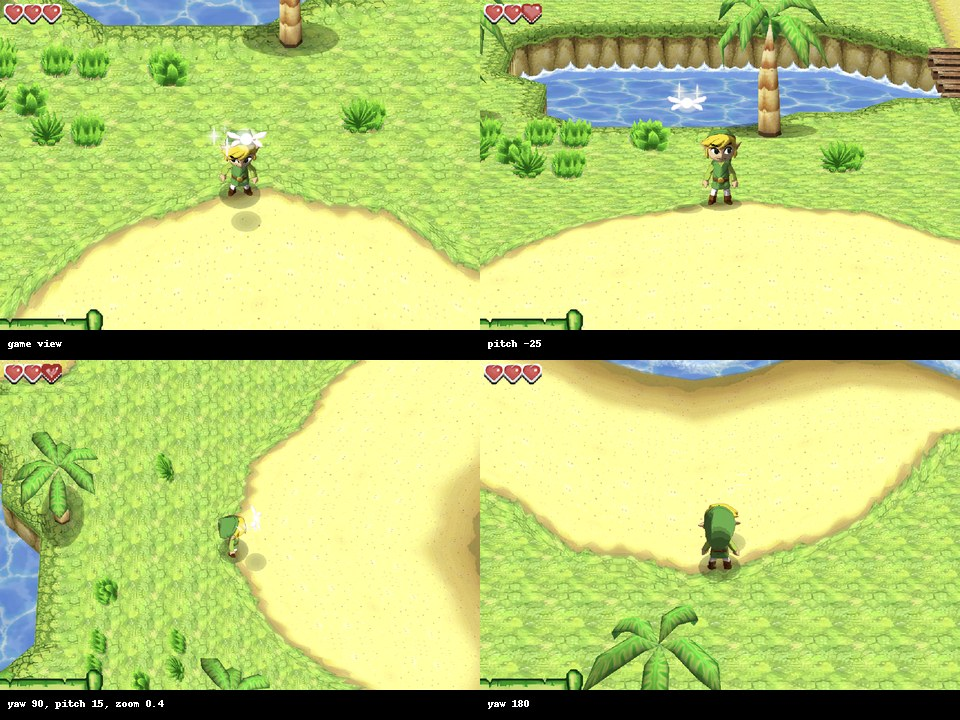
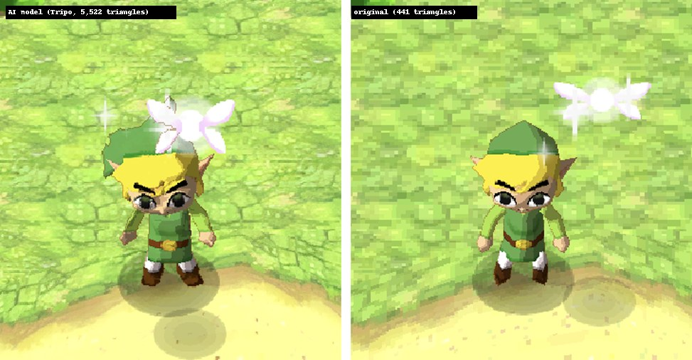
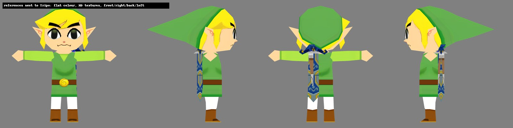
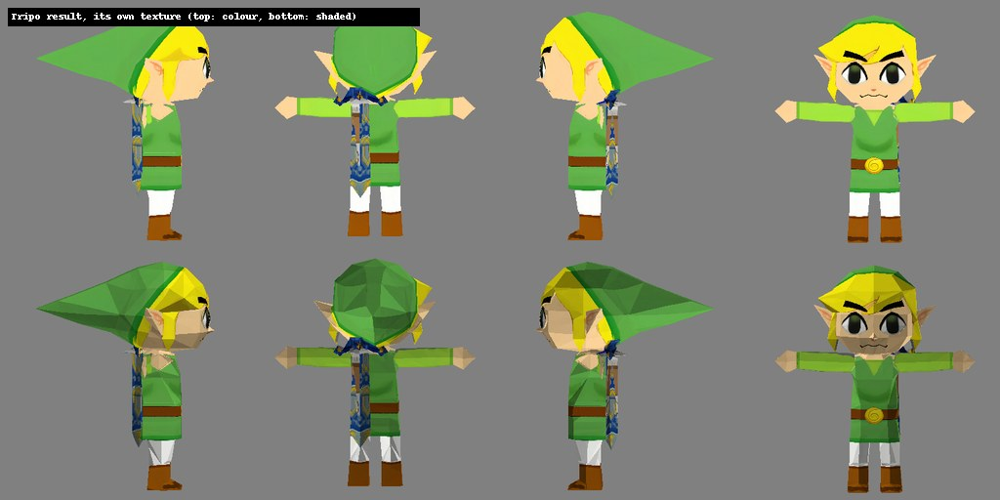
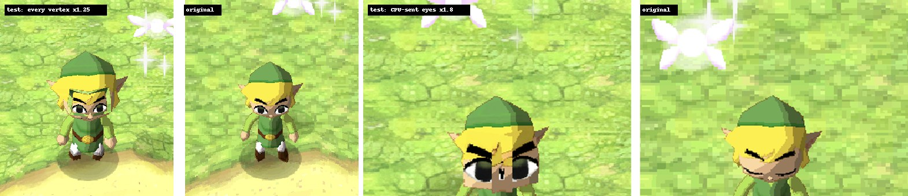
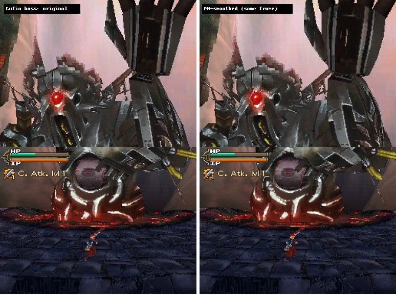

# Watermelon Thor

An experimental dual-screen Android fork of [melonDS](https://melonds.kuribo64.net/) tuned for the
AYN Thor, with HD texture pack support, per-layer upscaling filters, and core fixes that upstream
doesn't have yet.

Based on [WatermelonDS](https://github.com/SapphireRhodonite/WatermelonDS) (formerly melonDualDS) by
SapphireRhodonite, itself built on [rafaelvcaetano's melonDS Android port](https://github.com/rafaelvcaetano/melonDS-android).
Currently synced to WatermelonDS **0.7.0**.

**Per game:** [Game enhancements](game-enhancements/README.md) · [Recipes and how
to add a game](tools/hd_remaster/games/README.md) · [The remastering tool](tools/hd_remaster/README.md) ·
[AI portrait redraws](tools/hd_remaster/REDRAW.md)

"Experimental" is meant literally: this fork exists to try renderer ideas on one specific handheld.
Expect rough edges on anything that isn't a Thor.

## How it differs from WatermelonDS

Everything WatermelonDS 0.7.0 has is here: the Vulkan renderer and FastPath, dual-screen and
external display support, RetroAchievements, RetroArch shader presets. On top of that:

| Area | WatermelonDS 0.7.0 | Watermelon Thor |
| --- | --- | --- |
| Target device | Any Android device | Tuned and tested on the AYN Thor (Snapdragon 8 Gen 2, two panels) |
| HD texture packs | — | Dump and replace 3D textures, 2D sprites and BG tiles, also under a blend or fade that leaves the picture as it is (full-strength alpha, brightness 0) |
| HD remastering | — | Build an AI-upscaled pack for a whole game straight from its ROM, no playthrough needed |
| HD text | — | Text the game draws at runtime is redrawn from an upscaled copy of its own font, in sprites and in BG layers, without the native letters' blocky edge around it (Spirit Tracks' message boxes, Phantom Hourglass' story, Lufia's dialogue) |
| AI redraws | — | Character portraits redrawn by an image model from the official art, checked against the game's faces ([guide](tools/hd_remaster/REDRAW.md)) |
| HD 3D models | — | A pack can replace any 3D model part (Vulkan renderer): the new mesh hangs on the game's own skeleton and animations and is lit by the game's lights; smoothing of the original models with no new art, or new meshes from any 3D tool or from an AI model generator (Tripo), with their own HD texture ([3D models](tools/hd_remaster/README.md#3d-models-first-step-extraction-and-keys)) |
| Free camera | — | The right stick orbits and zooms the 3D view of any game around the screen centre, the D-pad turns with it (Settings -> Input, off by default); a pack's `camera.txt` turns it on for its game, e.g. Phantom Hourglass with the camera behind Link |
| Upscaling | Full-screen RetroArch shaders | Also per-layer filters for 3D, sprites and BG separately (ScaleFX, Anime4K, HQ2x, ...) with a disk cache |
| In-game overlay | Pause menu | Adds a turbo speed picker, live texture-filter switching, and "stretch to fit both screens" |
| Enhancements (widescreen and more) | — | An "Enhancements" pause-menu panel for games whose bundled cheat database has visual codes (about 300 games): widescreen 16:9 / 16:10 (the top screen stretches to match, so 3D gets a wider view at the right proportions; 2D menus and HUDs stretch), smooth 3D edges (anti-aliasing, no outlines) and draw distance, each with its own switch. Some games apply a change from the next scene, or on the next launch |
| Frameskip | — | Off / Manual (draw 1 frame in 2-5) / Auto (only when running behind) for the Vulkan renderer; a skipped frame still runs, and scenes that alternate 3D between screens are never skipped |
| Input | Single-button hotkeys | Adds modifier combos, so a hotkey can sit behind a chord; an unassigned stick click no longer washes out the top screen |
| Cheats | Starts with an empty database; XML imports drop every cheat that is not inside a folder | Ships DeadSkullzJr's NDS(i) cheat database (4079 games), loaded per game when its cheats are opened; XML imports keep cheats listed directly under a game (often the master code); codes we found broken are replaced by working ones and missing ones added ([`code_fixes.txt`](app/src/main/assets/cheats/code_fixes.txt): Star Fox Command's widescreen fixed; widescreen for the European Mario Kart DS, New Super Mario Bros., Sonic & SEGA All-Stars Racing and Burnout Legends) |
| Default renderer | Software | Vulkan on devices that support it (software otherwise), so packs and filters work out of the box |
| Dual-screen rendering | Dual-screen presets and layouts | Adds fixes for flicker, stale lines and wrong-screen content on alternating dual-3D scenes, in both the Compatibility and FastPath profiles; videos shown in VRAM display mode play (Castlevania: Dawn of Sorrow's intro was black), 2D drawn over captured 3D no longer blinks (Hotel Dusk), white boot screens no longer flash black for a frame (Star Fox Command, Solatorobo), "depth equal" decals such as Phantom Hourglass' character shadows draw fully, and loading a save state (or rewinding) no longer flashes a white or half-drawn screen for a frame (Hotel Dusk, Spirit Tracks) |
| ROM list | Homebrew without a banner is missing (#200); overlapping scans | Homebrew is listed; scans and icon loading read one ROM at a time; list rows and grid cards show HD (texture pack installed), ENH (widescreen, anti-aliasing or draw-distance codes) and CHT (cheats) badges, with matching filters |
| CPU / JIT | melonDS core as of Nov 2025 | ARM64 JIT fixes and speedups (see below) |
| 3D draw calls | The default (Compatibility) Vulkan profile sends every polygon, and every polygon's edge-mark outline, as its own draw | Consecutive polygons (opaque, translucent, outlines) with the same state go out as one draw, with pixel-identical output: Phantom Hourglass' storybook 7.3 -> 2.4 ms of 3D GPU time, its overworld 5.3 -> 4.2 ms, Diddy Kong Racing's intro 1.8 -> 1.3 ms |
| Saves and audio | — | Crash-safe save writes; importing the save that already sits next to the ROM no longer empties it; changing the volume in-game (including from 0) keeps the sound playing; fast-forward audio is time-stretched: everything plays, faster, at the original pitch instead of choppy |
| RetroAchievements | Keep-alive ping blocks the emulator for the network round trip every two minutes | Ping is sent off the emulator thread, so it no longer causes periodic hitches |
| Install | Application ID `me.magnum.melondualds` | Own application ID `app.watermelonthor`, so it installs alongside WatermelonDS and melonDS; its settings files in shared folders have their own names (`WatermelonThor.opts`, `<game>.thor.opts`) |
| Updates | In-app updater that downloads WatermelonDS releases from GitHub | No in-app updater: new builds are installed by hand |
| Reverse engineering | — | Debug builds carry a toolkit for game-specific fixes: memory search, read and write, watchpoints ("which code writes this", by address or by value), call traces, a GDB stub on the device's loopback, and Ghidra import of the live RAM or the ROM ([tools/re](tools/re/README.md)) |
| Remaster Studio | — | A local web app for the HD pipeline, the renderer checks and the Thor ([tools/studio](tools/studio/README.md)) |

**Install note:** this fork has its own application ID, `app.watermelonthor` (`.dev` for debug
builds, `.nightly` for nightly builds), so it installs **alongside** WatermelonDS and melonDS
instead of replacing them. Each app keeps its own settings and internal data (such as HD packs
and the filter cache). Builds from before the ID change used WatermelonDS's ID
(`me.magnum.melondualds`) and installed over it; the new ID does not pick up their data.

This repository is self-contained: the emulator core (`melonDS-android-lib/`, derived from the
[melonDS](https://github.com/melonDS-emu/melonDS) core) is part of the tree, with no core submodule.

## Game enhancements

Some of what this fork does is for particular games: HD packs built from the ROM (Lufia, Phantom
Hourglass, Spirit Tracks, Nostalgia, Chrono Trigger, Rosario + Vampire, whose own picture,
sprite and font formats the tool reads), AI-redrawn portraits (Lufia), an HD 3D Link
and a camera behind him (Phantom Hourglass), working widescreen codes where the bundled ones were
broken or missing (Star Fox Command, the European Mario Kart DS, New Super Mario Bros., Sonic &
SEGA All-Stars Racing and Burnout Legends), and renderer fixes first seen on one game (Hotel Dusk,
Castlevania: Dawn of Sorrow, Metroid Prime Hunters, Dragon Quest IV and more).
**[Game enhancements](game-enhancements/README.md)** has a page per game: what it gets, how it
was checked, and what is still missing.

## What this fork adds

### HD remastering from the ROM
Making an HD pack used to mean playing the whole game with texture dumping on, then upscaling
whatever got dumped. [`tools/hd_remaster`](tools/hd_remaster/README.md) skips the playthrough:

```
powershell -ExecutionPolicy Bypass -File tools\hd_remaster\remaster.ps1 game.nds -Push
```

Prefer buttons? [Watermelon Remaster Studio](tools/studio/README.md) runs the same steps from a local web page, with live output, a live view of both Thor screens and the renderer checks (`tools\studio\studio.ps1`).

Games with a [recipe](tools/hd_remaster/games/README.md) get the settings and game-specific
rules that were verified for them, so anyone with the same ROM gets the same pack. **[The HD
games list](game-enhancements/README.md)** has every one - Lufia: Curse of the Sinistrals,
Phantom Hourglass, Spirit Tracks, Nostalgia and Chrono Trigger so far - with before/after
screenshots, pack sizes, build times and what each pack covers, plus the games wanted next.


It decodes every 3D texture, sprite and background in the ROM exactly as the emulator does,
names each one by the key the emulator looks it up by, upscales them with an AI model
(4x-UltraSharp by default) on an NVIDIA GPU, and installs the pack over adb. Sprites and
backgrounds are upscaled as whole cells and screens, then cut apart, so they stay seamless.
Verified against what was dumped during real play of Lufia: Curse of the Sinistrals: 81% of
the 3D textures and every sprite that comes from the ROM's graphics are reproduced, all
pixel-identical. What's left is built by the game at runtime (captured scenes, parts assembled
in memory) and still gets the per-layer filters. On the device, pack images load the first time
the game shows them, so a whole-game pack only costs memory for what is on screen.

**Text** is drawn by the game one glyph at a time, so no image of it exists to replace. The
pack carries the game's own fonts instead (Nitro NFTR files) with an upscaled copy of every
glyph. The emulator finds the glyphs in the sprites the pack didn't cover by exact pixel match
and redraws each one from the upscaled font, in the colours the game used. Verified on Phantom
Hourglass's story text and Lufia's dialogue boxes.

HD art isn't clipped to the blocky outline of the pixel art it replaces: an edge the upscaler
smoothed shows the layer behind it, and may extend a pixel past the original silhouette where
nothing covered it.

**3D models** (Vulkan renderer) are replaced part by part. Each part of a model is a list of
drawing commands the game sends to the DS 3D chip, recognised by a fingerprint of its content,
whether the game sends it by DMA or writes it with the CPU (Link's eyes). The original still
runs, so the game behaves exactly the same; its polygons are hidden and the pack's version is
drawn in their place from the same bone positions, lights and camera, without the DS polygon
limits. Exact copies render pixel-identical to the originals (Phantom Hourglass, Lufia). A pack
can use:

* smoothing of the original models, no new art needed (Link, Maxim and a Lufia boss, 60 fps);
* models edited in any 3D tool (`hd_remaster.py models extract` exports them, `models build`
  reads them back);
* AI-generated models: `models ai --textured` renders a character from four sides, has Tripo
  build a textured mesh, fits it onto the game's skeleton and gives it its own texture in the
  slot of the part it replaces. The first one, Phantom Hourglass' Link (5,522 triangles, $0.40),
  runs in-game at 60 fps.

What the first AI model taught us (see the screenshot below): the pipeline works, but this Link
looks worse than the original up close, for reasons we can fix:

* its 4096x4096 texture had to fit Link's 64x64 body texture slot at the pack's 4x scale, so it
  shrank to 256x256 and the face went blurry;
* that texture is cut into many small islands, and shrinking it blended them and let the
  transparent gaps between them show (the torn edge on the cap);
* the game's own sharp, blinking eye and eyebrow parts were hidden in favour of eyes painted into
  that one texture;
* the generator was shown pictures of a 441-triangle model, so it rebuilt a lumpy copy of it.

**Where this is going: main characters at a Wii U-like level** (think Wind Waker HD). Instead of
low-poly renders, the generator will get HD reference views: an image model redraws our four
views of the in-game model in high detail, guided by the official artwork, keeping the game's
proportions and pose. Model textures get their own, much larger resolution; texture islands are
padded; the game's animated eye parts stay; Blender cleans up the mesh. Each step is reviewed on
the Thor before the next character. Per-pixel lighting and shadows, the rest of a Wii U look, would
be a later renderer step.

**Free camera** (Settings -> Input -> Free camera, off by default). The right stick turns the 3D
view around what is at the screen centre (the player, in games whose camera follows one): left and
right orbit about the game camera's own up direction, so the ground stays level; up and down tilt.
Hold R3 and push up or down to zoom, tap R3 to go back to the game's view. While the view is
turned, the D-pad turns with it (to the nearest of 8 directions), so up walks away from the new
view. It is done in the emulator, no game patch: only what gets drawn goes through the turned
camera. A game that asks the hardware whether a model is on screen (BOX_TEST) gets "yes" for what
the turned view shows; a game that culls in its own code keeps culling for its own camera, so
that scenery stays missing at wide angles until a per-game patch exists (Mario Kart DS: the near
track section when turned 60 degrees; Phantom Hourglass' Mercay draws its whole island, so
nothing is missing there). Menus drawn with an orthographic projection stay put. With the
setting on, the right stick and R3 belong to the camera (a right-stick binding such as fast
forward is suspended). The switch is saved; the view starts from the game's own each launch.



**Behind-Link camera (Phantom Hourglass).** A game's HD pack can carry a camera profile,
`camera.txt` (`texturepacks/<GAMECODE>/camera.txt` on the device; the tool copies
`tools/hd_remaster/games/<CODE>/camera.txt` into the pack it builds). It turns the free camera on
for that game by itself, whatever the setting, and sets its tilt, distance and behaviour. Phantom
Hourglass' profile puts the camera low behind Link (`pitch -32`, `zoom -0.3`) and makes it follow
him (`follow dpad`): a D-pad direction keeps the world direction it had when pressed, so Link
walks straight while the view swings round behind him, and a new direction is read in the new
view; walking towards the camera leaves the view alone. The right stick still turns, tilts and
zooms on top of it, and R3 goes back to the profile's tilt and distance. 60 fps on the Thor. As a
game camera that was never made for it: a tree between the camera and Link can hide him, and
past the end of the sea the background colour shows (it happens to look like sky). The orbit
centre is the nearer side of what is at the screen centre, eased over a few frames, so the view
holds steady when Link jumps off a ledge or falls in the sea.

```
free_camera on      # on for this game
follow dpad         # swing round behind the way the D-pad walks the player
pitch -32           # degrees of tilt (negative = flatter)
zoom -0.3           # closer (fraction of the distance to the screen centre)
follow_speed 2.0    # radians per second at most
```


The Remaster Studio has a page for all of it, and debug builds can trace which models a scene
draws.

The first AI model in-game, on the Thor: Phantom Hourglass' Link rebuilt by Tripo from four
views of the original, on the game's own skeleton and lights (left), next to the original:



What Tripo got (the four flat-colour views with the pack's HD textures, then the textured mesh
it returned):




Proof-of-concept tests on the way: every vertex of Link scaled 1.25 (the replacement follows
his bones), his eyes and eyebrows (sent by the CPU, not DMA) scaled 1.8, and Lufia's boss
smoothed with PN triangles, compared on the same emulated frame:




### HD texture packs
* **3D texture dump & replace**: content-hash keyed (texture hash + palette hash), compatible
  with the desktop melonDS HD pack format, so packs can be authored and verified on PC and used
  on device unchanged.
* **2D sprite (OBJ) and BG tile dump & replace**: sprites and background tiles are dumped as
  assembled art and can be replaced with scaled versions (up to 4x).
* Packs live in `files/texturepacks/<GAMECODE>/`; dumps are written to `files/texturedumps/`.
* **Settings → Video → Load texture packs** turns packs on and off, also in a running game (on by
  default).

### Per-layer upscaling filters
* Independent filter selection for **3D textures**, **OBJ sprites**, and **BG layers**
  (Settings → Video): nearest, bilinear, and a set of pixel-art filters including Scale2x,
  HQ2x, SaI, Eagle, MMPX, a faithful multi-pass **ScaleFX** port, and **Anime4K (DoG)**.
* **Anime4K** is applied *per producer*, not to the finished frame, so sprite art can get it
  while 3D geometry and backgrounds are left alone. It is Anime4K v4.0.1's
  Difference-of-Gaussians upscaler with the separable passes fused into one 3×3 neighbourhood,
  which keeps full-frame temporaries (and their bandwidth cost) off tile-based mobile GPUs.
* Filters run in the Vulkan compositor as a cached pre-pass: static scenes cost nothing
  (content-hashed reuse), and 3D texture filtering is cached per texture at upload.
* A persistent on-disk filter cache (Settings → Video → "Filter disk cache") keeps filtered
  results between sessions, so a second launch of the same game does no filtering work at all.
* No full-screen smoothing: original pixels stay sharp unless a layer's filter says otherwise.

### In-game overlay
* **Turbo** with a speed picker (1.5x/2x/3x/4x/8x/uncapped) that takes effect while turbo is
  already held, rather than only at configuration time.
* **Texture filter switching** for the 3D, sprite and BG producers without leaving the game.
  The renderer applies these to the live `Renderer3D`, so no reload is needed.
* **Stretch to fit both screens** (pause menu → Dual Screen Presets): one toggle drops both
  letterboxing rules so each DS screen fills its physical panel edge to edge. The individual
  "Keep DS aspect ratio" and "Integer scale" switches remain below it for finer control.

### Input
* Key bindings can take an optional **modifier**, so a hotkey can sit behind a chord and leave
  the plain button free for the game. Combos are matched before plain bindings; the unmodified
  key still works on its own. Existing configurations load unchanged.

### Cheats
* **Cheats outside folders**: R4CCE and DeSmuME cheat XMLs list some cheats (often the master
  code) directly under the game. The importer only read cheats inside a `<folder>` and dropped
  the rest; they now go into a folder named after the game, listed first.
* **Bundled cheat database**: DeadSkullzJr's NDS(i) Cheat Database (2021-12-25 edition, 4079
  games, ~600k cheats, AGPL v3) ships in the APK. A game's cheats are copied into the app database
  the first time its cheats screen is opened, so nothing is imported at startup and the database
  stays small. Credits, source and how to update it: [tools/cheats](tools/cheats/README.md).

### Fixes not in upstream
These are bugs present in WatermelonDS, rafaelvcaetano's port and (for the JIT ones) the melonDS
core itself:
* **JIT over-invalidation**: a shadowed variable in `ARMJIT::InvalidateByAddr` made any write
  into a 512-byte range throw away every compiled block in it, not just the blocks covering the
  written bytes.
* **JIT Thumb literal loads**: the ARM64 JIT could fold a stale, rotated literal into a block when
  a Thumb PC-relative load fell back from its aligned fast path.
* **Save data safety**: saves were written with a truncating open, so a process killed mid-write
  left an empty file; a failed write was treated as success and never retried.
* **Audio**: raising the volume from 0 tore the audio stream down instead of creating it, so
  sound only came back after a second change.
* **Dual-screen presentation** on the Thor's two panels: screen-swap alternation, capture-backed
  scenes, and frame pacing under load, verified with per-display captures.
* **3D draw batching**: the Compatibility profile drew each polygon, and each polygon's
  edge-mark outline, with its own draw call. Consecutive opaque polygons, single-pass translucent
  polygons and outlines that share every piece of per-draw state (polygon attributes, texture,
  pipeline, edge colour) now go out as one draw; Vulkan keeps primitive order inside a draw, so the
  picture is identical (tools/frame_compare: 13 scenes, every frame the same as before). Up to 67%
  less 3D GPU time in Phantom Hourglass.
* **Core performance**: JIT and fastmem fixes (coprocessor register access, DTCM host mapping)
  that recovered a large chunk of CPU time on heavy scenes, plus renderer thread-safety and
  Vulkan lifecycle fixes throughout the compositor and presenter.

## Relationship to upstream

This fork tracks WatermelonDS and merges its releases rather than diverging. The upstream chain is:

[melonDS](https://github.com/melonDS-emu/melonDS) → [rafaelvcaetano/melonDS-android-lib](https://github.com/rafaelvcaetano/melonDS-android-lib)
and [melonDS-android](https://github.com/rafaelvcaetano/melonDS-android) →
[SapphireRhodonite/melonDS-android-lib](https://github.com/SapphireRhodonite/melonDS-android-lib)
and [WatermelonDS](https://github.com/SapphireRhodonite/WatermelonDS) → this fork.

It also carries fixes from further up the chain that WatermelonDS 0.7.0 doesn't have yet:

* From rafaelvcaetano's port: a crash when sorting the ROM list with more than one never-played ROM.
* From the melonDS core: an SPU output buffer leak, loud pops when booting firmware, sanity
  checks that reject ROMs with broken headers, a VRAMSTAT fix, and touchscreen output clamped to
  12 bits.

<details>
<summary>Merge notes for contributors</summary>

Where both projects changed the same subsystem, the merge keeps whichever implementation was
verified on the Thor and adopts upstream's where it is strictly broader. Notable current examples:

* The exact-capture line cache is banked per screen-swap here, crossed with upstream's
  `CaptureSourceIdentity` rather than replaced by it.
* `createComputePipelineFromSpirv` stays a member function because the per-mode pre-pass shader
  split needs it from more than one caller.
* Upstream's structured-capture branch tree in the soft-packed frame latch supersedes the
  narrower payload merge this fork used to carry.

</details>

## Building

Requirements: JDK 21, Android NDK 28.x, CMake 3.22+, Rust (for librashader).

```
git clone --recurse-submodules https://github.com/noeldvictor/watermelon-DS-THOR-AI-FORK.git
cd watermelon-DS-THOR-AI-FORK
./gradlew :app:assembleGitHubProdDebug
```

The emulator core is part of this repository; the remaining submodules are third-party
libraries (oboe, faad2, enet).

The APK lands in `app/build/outputs/apk/gitHubProd/debug/`. On Windows, build from PowerShell and
set `JAVA_HOME` (JDK 21), `ANDROID_NDK_HOME`, and `CARGO`/`RUSTUP` to the executable paths;
the librashader plugin resolves its tools from those variables. Windows checkouts need
`git config core.longpaths true`.

Shader binaries are checked in. After editing any `.comp`/`.frag`/`.vert`, regenerate them with
`scripts/regenerate_vulkan_spirv.sh`, which finds `glslc` in the NDK's `shader-tools`.

## Credits

* [melonDS](https://github.com/melonDS-emu/melonDS) by Arisotura and the melonDS team
* [melonDS Android port](https://github.com/rafaelvcaetano/melonDS-android) by rafaelvcaetano
* [WatermelonDS](https://github.com/SapphireRhodonite/WatermelonDS) by SapphireRhodonite: Vulkan renderer,
  dual-screen and external display support, RetroAchievements, RetroArch shader presets
* [librashader](https://github.com/SnowflakePowered/librashader): RetroArch shader preset support
* [Anime4K](https://github.com/bloc97/Anime4K) by bloc97: the DoG upscaler used by the sprite
  filter (MIT). The mobile single-pass formulation follows the one in
  [Azahar](https://github.com/azahar-emu/azahar).
* The two JIT fixes were first proposed by Umberto-DEV in
  [rafaelvcaetano/melonDS-android-lib#11](https://github.com/rafaelvcaetano/melonDS-android-lib/pull/11)
  and [#12](https://github.com/rafaelvcaetano/melonDS-android-lib/pull/12); the save-safety issue
  was also identified in Umberto-DEV's fork, and the audio volume bug by jojodogm-ctrl.
* HD pack format inspired by the texture replacement systems of Dolphin and DuckStation
* HD remastering: the upscaler and its seam, alpha and tiling handling come from the ARMSX2
  Thor fork's disc-texture tooling; models load through
  [spandrel](https://github.com/chaiNNer-org/spandrel); the default model is
  [4x-UltraSharp](https://huggingface.co/Kim2091/UltraSharp) by Kim2091 (CC BY-NC-SA 4.0)

melonDS is free software licensed under the GPLv3; this fork retains that license.
