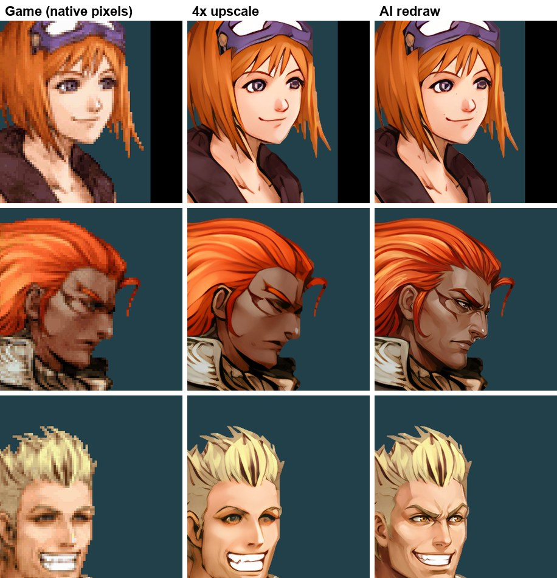

# Lufia: Curse of the Sinistrals

BSDE, USA.

| Enhancement | What it does | Checked |
| --- | --- | --- |
| HD pack | 3D textures, sprites, BG tiles and the dialogue font, AI-upscaled from the ROM (632 MB). Recipe and coverage: [BSDE](../tools/hd_remaster/games/BSDE/README.md) | 181/223 textures and 324/587 sprites dumped in play reproduced, all pixel-identical; intro, title, first town |
| AI portraits | 180 of the 229 character portraits redrawn from Yusuke Naora's official art, the main cast one call each and checked against the game's faces ([guide](../tools/hd_remaster/REDRAW.md)) | All installed; the rest stay upscaled |
| HD text | Dialogue (1bpp) and the outlined battle HUD, name plates, money and play time drawn from the game's own fonts, upscaled | Intro, battles |
| Portraits in play | Portraits found by their colours wherever the game loads them, two portraits in one dialogue, HD art over captured 3D scenes (capture passthrough), clean edges over 3D, no flicker in fades (`ff480941`, `42443880`, `ea7730f7`, `557a8f21`) | Intro, 180 s at full frame rate |
| Intro flashes | Stale frames shown out of order, white frames in the ocean dive and the top's 3D on the bottom for a frame are gone (`d248b42a`) | 180 s intro, 0 renderer events |
| Title screen | The bottom screen's island no longer alternates with white (`0b864c92`); the title logo's black outline stays black on FastPath (`71cc746f`) | Title, slot 7 |
| 3D smoothing (test) | PN-smoothed Maxim and boss models run at 60 fps, a proof that smoothing works on another engine | Boss fight, 400 frame-exact frames |

