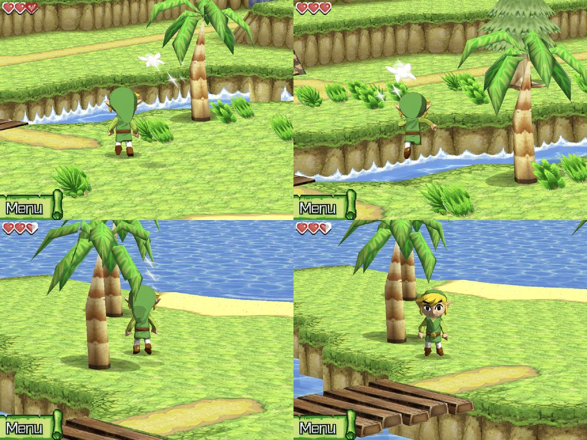

# The Legend of Zelda: Phantom Hourglass

AZEE, USA, with the D-pad patch (Link walks with the D-pad instead of the stylus).

| Enhancement | What it does | Checked |
| --- | --- | --- |
| HD pack | Title logo, storybook pages and their text, BG tiles, sprites and 3D textures, AI-upscaled from the ROM (309 MB). Recipe, build steps and coverage: [AZEE](../tools/hd_remaster/games/AZEE/README.md) | Title and prologue; BG tiles 92160/92160 lookups hit |
| HD text | The storybook's story text is redrawn from an upscaled copy of the game's own font | Prologue |
| HD Link | Link's model replaced by an HD one: an AI turnaround of the game model in the official art's style, built into a textured mesh by Tripo (7,826 triangles, 512x512 texture), split over the parts that hold its bones, with the game's own eyes, brows and mouth laid on as decals so blinking and expressions stay | Mercay, frame-exact before/after, 60 fps |
| Behind-Link camera | The free camera is on for this game (pack `camera.txt`): low behind Link, swinging round as he walks; the right stick turns, tilts and zooms on top; R3 resets | Mercay, 60 fps |
| Character shadows | Link's and Ciela's blob shadows (translucent "depth equal" quads) were missing on Vulkan; they draw now (`0066f665`) | Mercay beach, Vulkan vs software |
| Storybook | Pictures smaller than their texture (the storybook pages) are matched by the rows they fill (`333d0024`); the dual-screen storybook scene no longer flickers | Prologue, 0 flicker events |
| 3D draw batching | 3D GPU time on the storybook 7.3 -> 2.4 ms, overworld 5.3 -> 4.2 ms, identical pixels | frame_compare |

Not yet: the AI head is a little smaller than the original's and its bangs hide the top of the
eyes from the game's high camera; the battle-mode Links (`link_model_blue`, `_red`) share the
face parts. With the camera low, trees can hide Link, and past the end of the sea the background
colour shows. No scenery is culled on Mercay: the island is one model drawn whole every frame (the
game makes no hardware box tests), so the turned camera misses nothing there.

