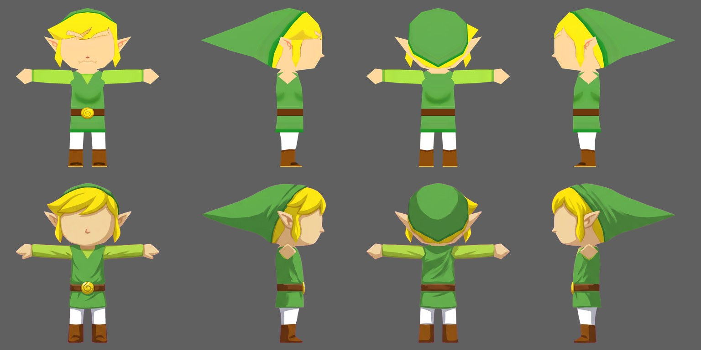
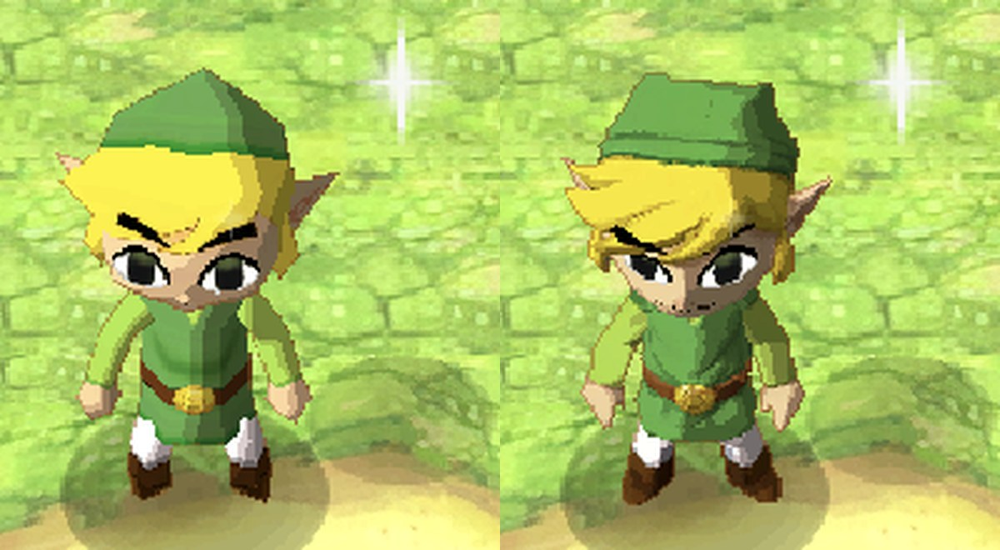

# HD remastering

Build an HD texture pack for a DS game straight from its ROM, without playing through it to dump
textures first. Every texture in the ROM is decoded, named by the key Watermelon Thor looks it up
by, upscaled with an AI model on your PC, and pushed to the device.

```
ROM ─▶ extract ─▶ upscale (GPU) ─▶ build ─▶ push ─▶ play
```

## Setup (once)

Windows with an NVIDIA GPU:

```
powershell -ExecutionPolicy Bypass -File tools\hd_remaster\setup.ps1
```

This creates `tools/hd_remaster/.venv` with CUDA PyTorch and
[spandrel](https://github.com/chaiNNer-org/spandrel), and downloads the default model,
[4x-UltraSharp](https://huggingface.co/Kim2091/UltraSharp) (CC BY-NC-SA 4.0, so packs made with
it are for personal use). Any ESRGAN-family model spandrel can load works with `--model`.

## Remaster a game

One command sets up on first run, builds the pack and installs it on the attached device:

```
powershell -ExecutionPolicy Bypass -File tools\hd_remaster\remaster.ps1 path\to\game.nds -Push
```

If the game has a recipe in [`games/`](games/README.md), it's applied automatically: the
models, scale and game-specific rules that were verified for it, plus a check that your ROM and
the key counts match. Games without one run with the defaults.

The individual steps, run with the venv's python:

```
.venv\Scripts\python hd_remaster.py all  path\to\game.nds     # extract + upscale + build
.venv\Scripts\python hd_remaster.py push packs\<GAMECODE>       # install on the device
```

Then start the game. The pack is picked up at game start; Settings → Video → Load texture packs
is on by default (and switches packs off, also in a running game). Packs apply with the Vulkan renderer
(the default) or the Compute renderer.

The steps can also run one at a time (`extract`, `upscale`, `build`, `push`). `upscale` resumes
where it stopped, and `build --native` makes a 1x pack from the unscaled images, which should
render exactly like no pack at all: a quick check that every key and pixel is right.

## Pack format: ASTC in a zip (the standard from 2026-10-03)

What `build` and `push` produce, and what the emulator reads:

- One file per game: `packs/<CODE>.zip` on the PC, `files/texturepacks/<CODE>.zip` on the Thor.
  Deflate-compressed.
- Every image is ASTC 4x4 (`.astc`: astcenc's 16-byte header, then 16-byte blocks), named by its
  pack key as before: `textures/`, `sprites/`, `bgtiles/`, `fonts/` (glyph atlases),
  `models/textures/`. Text files ride along unchanged: fonts' `.nftr`, `models/*.dl` and
  `originals.txt`, `camera.txt`.
- Why: the Thor's Adreno 740 samples ASTC in hardware, so images upload as they are (no PNG
  decode on the device) at 8 bits per pixel instead of 32, and ASTC data still deflates (PNG
  doesn't). 4x4 is the near-lossless block size: thin text and sprite outlines survive.
- PNGs stay an intermediate of this tool (`work/<CODE>/native`, `work/<CODE>/upscaled`); packs
  carry ASTC only. 2D, fonts, 3D textures and model textures all use it; the packs already on
  the Thor are rebuilt this way and their folders removed.
- `build` assembles the PNG staging folder `packs/<CODE>/` as before, then encodes it to
  `packs/<CODE>.zip` ([astcpack.py](astcpack.py): images share 2048-wide sheets so the encoder
  runs once per sheet, ~1800 images/s; results cached by content in `work/<CODE>/astc_cache`).
  Quality: median 46 dB, worst seen 33 dB (busy art); thin text and outlines keep their shape.
- `push packs/<CODE>` installs the zip and deletes the game's folder pack (and its backups) on
  the device. `convert <CODE>` turns a folder pack already on the device into the zip: it pulls
  exactly what is installed (art pushed outside a full build included), encodes, checks a
  sample's PSNR, installs and removes the folder.
- `build --native` (the 1x check pack) stays a PNG folder: it must render exactly like no pack,
  and ASTC is lossy.
- On the device: `HDTexPack: indexed N entries from .../texturepacks/<CODE>.zip`. Image sizes
  come from the key names and pack.txt's scale, so indexing never opens an image. *Next: the
  GPU samples ASTC directly; today each image is decoded to pixels on first use.*

## How it works

A DS game uploads a texture's bytes to video memory unchanged, and the pack key is a hash of
those bytes, so the key of every texture can be computed from the ROM.

- **Finding textures.** The ROM filesystem, NARC archives and LZ10/LZ11 compression are
  unpacked. Games that keep their files in a custom archive still store standard Nitro files
  inside it, often compressed; those are found by the magic an LZ stream leaves in the clear.
- **Palettes.** A model's materials say which palette each texture is drawn with, so only those
  pairs are written. Textures no material names fall back to the palettes in their own file.
- **Decoding** matches melonDS bit for bit, including the RGB5 to RGB6 expansion and all seven
  texture formats.
- **Pictures smaller than their texture.** DS texture sizes are powers of two, so a 256x192
  screen picture (Phantom Hourglass's storybook pages) is uploaded into a 256x256 texture whose
  last 64 rows hold whatever video memory held before. Its key ends in `_rows192` and hashes
  only the rows the picture fills; the emulator retries a missed texture with that shorter hash
  for the sizes a pack has such entries for.
- **Upscaling** pads each texture before inference so the model doesn't invent a border that
  shows as a seam when the texture repeats. The material states whether each axis repeats,
  mirrors or clamps, and the padding follows it per axis. Transparent pixels are filled from
  their visible neighbours first, and binary alpha stays binary.
- **2D sprites and backgrounds** come from the standard NCGR/NCLR/NCER/NSCR files. Every sprite
  cell and background screen is assembled at native size and upscaled as a whole, then cut into
  the per-sprite and per-tile images the emulator looks up, so neighbouring pieces stay seamless.
  A sprite that another sprite overlaps is upscaled on its own instead. Where the files don't
  pin down a palette (256-colour art, whose key covers the whole palette memory), the key is
  built from a best guess; a wrong guess just doesn't match. Game-specific load rules that can't
  be read from the files live in `twod.PROFILES` (Lufia's portraits, for example, are uploaded
  with their colour indices shifted by 48).
- **Text** is drawn by games at runtime from Nitro fonts (NFTR), one glyph at a time, so it
  never exists as an image. Each font goes into the pack's `fonts/` folder as the font file
  itself plus an upscaled atlas of its glyphs (grey shade levels; `fonts.py`). On the device,
  sprites the pack has no image for are searched for glyphs by exact pixel match, and each glyph
  is redrawn from the atlas in the palette colours the game drew it with.
- **Games' own formats.** Some games use none of the standard files. The tool reads a few such
  formats too: Rosario + Vampire's BB archives, BBG pictures ([bbg.py](bbg.py)), BAC sprite
  animations ([bac.py](bac.py), each character frame upscaled over the whole body so eyes and
  mouth join without a seam) and `#FNT` font ([fnt.py](fnt.py), converted to NFTR for the HD
  text). See [games/YVLJ](games/YVLJ/README.md).
- **On the device**, pack images are indexed at game start and decoded the first time the game
  shows them, so a whole-game pack costs memory only for what is on screen.

## AI redraws (portraits)

**The full guide, with what worked, what didn't and what it cost: [REDRAW.md](REDRAW.md).**

An upscaler can only sharpen what the pixels hold. A 128x160 portrait has two or three pixels
per eye, so even a good model draws the eyes wrong. `redraw.py` sends the upscale plus
reference artwork (the game's official character art) to an image model on
[OpenRouter](https://openrouter.ai) and asks for a cleaner version of the same painting: same
framing, pose, colours and expression, with the eyes, mouth and details redrawn properly.

- **Key:** put `OPENROUTER_API_KEY=...` in `tools/hd_remaster/.env` (git ignores it).
- **Pick a model:** `redraw.py models` lists the image models; `redraw.py try work\<CODE> <key>
  --models a,b,c --ref refs\x.jpg --name X` runs one image through several and writes a
  side-by-side sheet. On Lufia, `google/gemini-3-pro-image` won (clean anatomy, kept the
  character's own markings, aligns well; about $0.14 per image).
- **A character:** `redraw.py portrait work\<CODE> --match talk_f_gades_ --name Gades --ref
  refs\gades.jpg` redraws the master expression (`--master normal`), then every other expression
  as an edit of the master, so the body stays the same between expressions. Only where the
  game's own expression differs from the master (grown a little and softened) comes from the
  expression's redraw.
- **The whole cast, cheaper:** `redraw.py cast work\<CODE> --prefix talk_f_ --config
  games\<CODE>\redraw.json` groups each character's expressions by frame (the game cuts some
  to other sizes or poses; each group gets its own master), redraws each master in one call,
  then the rest of the group four at a time: a 2x2 sheet of face close-ups (the box where the
  expressions differ) in one call, split and blended back into the master. A quarter of the
  cost per expression, but not recommended: on Lufia a third of the results failed the check
  (eye colours, drifting expressions, seams); see [REDRAW.md](REDRAW.md#what-didnt-work). `redraw.json` maps character ids to display names and reference files.
- **One image:** `redraw.py one work\<CODE> <key> --kind textures --ref refs\logo.jpg --what
  "the title logo"` (the input is padded to the nearest shape the model returns, then cropped).
- Every result is aligned back onto the upscale and cut out with the upscale's own alpha: the
  outline stays the game's, so the art drops into the pack in place. Soft edge pixels get the
  interior colours, not the model's grey background; grey the model left inside the outline is
  filled from the upscale.
- Results go to `work\<CODE>\redrawn\`, which `build` prefers over `upscaled\`. Every call's
  cost goes to `work\<CODE>\redraw\ledger.jsonl`; `--budget` (default $20) stops a run before
  that total passes it. `--reuse` rebuilds from the saved model outputs without new calls.
- References are not in the repo (the art belongs to its publisher). For Lufia they are the
  official character art on Creative Uncut, e.g.
  `https://cucdn.creativeuncut.com/gallery-50/art/lcots-gades.jpg` (the CDN wants the gallery
  page as Referer), saved to `work\<CODE>\refs\`.

## HD sprites from a 3D model (animated characters)

A walking character is dozens of small frames (Crono has 209 cells). Redrawing each one with an
image model drifts from frame to frame, so the walk shimmers. [chara3d.py](chara3d.py) builds one
3D model of the character instead and renders every frame from it: one look, every direction,
every frame. First tested on Chrono Trigger's Crono (2026-10-03).

1. `chara3d.py turnaround work\<CODE> --name crono --sheet "Chara/Chara_0000.NCER~lz" --front 0
   --side 12 --back 3 --art refs\a.jpg,refs\b.jpg --character "Crono from Chrono Trigger"`:
   the standing frames (front, side facing left, back) plus official art go to Gemini, which
   draws a 2x2 turnaround in an A-pose with flat colours, in the art's style and the sprite's
   proportions ($0.14; capped by `--usd`).
2. `chara3d.py model work\<CODE> --name crono`: Tripo multiview-to-model, textured (40 credits).
3. `chara3d.py animate work\<CODE> --name crono --anims idle,walk,run`: Tripo rig check (free),
   humanoid auto rig (25 credits) and one preset animation each, played in place (10 credits
   each). Credits are logged in `chara3d\<name>\tripo_ledger.jsonl`, capped by `--credits`.
4. `chara3d.py sprites work\<CODE> --name crono --sheet ... --front 0 --side 12 --back 3
   --cells 0-39 --apply`: Blender 5.1 (in the background, [chara3d_blender.py](chara3d_blender.py))
   renders each clip at 6-24 phases in four directions, toon shaded (two flat bands lit from the
   upper left) with an ink outline, at 12 degrees above the horizon. Every native cell then gets
   the render that fits it best: its facing comes from the game's own standing frames (the head
   region compared native to native; the render's colours differ from the palette too much to tell
   a face from the back of a head), then the pose and position by silhouette overlap at native
   size, feet aligned, one scale for all frames. `review_sprites.png` shows each cell next to its
   render; `--apply` writes the fits to `redrawn\assets2d`, which `build` prefers.

Limits found on the way: the preset clips cover standing, walking and running only, so battle,
sword and one-off poses keep their upscale (`--cells` keeps the fit to the cells the clips cover;
silhouette overlap alone let some arms-up frames through). Chrono Trigger's dash (a leaping
stride) fits no preset: `flee_01`/`flee_02` (sprinting) gave panicked arm poses and won calm frames
by silhouette, so `--clips` (default `idle,walk,run`) picks the clips to fit with, and
`--variant run,1.6,12` (limb swings x1.6, 12 degree forward lean) didn't reach the stride either.
A facing guess far from every standing frame (`--facing-sure`) lets the fit try all four. The
camera framing comes from the idle clip with a wide margin: at 1.45 the side-facing run frames
were cut off at the edge of the render. Freestyle's crease, border and contour
lines cover a lumpy AI mesh, so only the outer outline is inked; its width is `--outline` (the
scene thickness is a multiplier, keep it 1). Tripo's animated GLBs carry a stray icosphere that the
renderer drops.

## Checking a pack against the real game

If you have textures dumped in-game (Settings → Video → dump textures), compare them with an
extraction:

```
.venv\Scripts\python hd_remaster.py verify work\<GAMECODE> --dumps <dumps>\textures --sprites <dumps>\sprites
```

On Lufia: Curse of the Sinistrals:

| | Reproduced from the ROM | Pixel-identical |
| --- | --- | --- |
| 3D textures dumped during play | 181 of 223 | 181 of 181 |
| Sprites dumped during play | 324 of 587 | 324 of 324 |

The rest are built by the game at runtime: character parts assembled into one texture, blank
render buffers, dialogue text drawn into sprite memory, and captures of the 3D scene shown as
sprites. The per-layer filters still apply to those.

## 3D models (first step: extraction and keys)

Models are NSBMD files (MDL0 blocks). `models3d.py` reads them the way the SDK draws them: the
node tree, the render commands (SBC: node matrices into matrix-stack slots, skinning blends,
materials, shapes) and each shape's display list, decoded like the geometry engine does, into
bind-pose triangles with texture coordinates, normals, colours and the stack slot every vertex
used. `render3d.py` draws them (numpy only) with the model's own textures, which is how bind
poses are checked and how reference pictures for an AI model generator are made.

A shape's display list reaches the geometry FIFO byte for byte (the SDK DMAs it from the model
file), so it is keyed like the textures, by content: `mdl1_<size>_<xxh64>`. The debug build's
`dl_trace` tool (tools/re) lists the keys a scene sends. Phantom Hourglass, Mercay beach: all 33
display lists sent in 6 seconds (7351 transfers: Link, the island, palm trees, bridge, beach,
sea) are shapes extracted from the ROM; 1285 models, 4844 distinct shapes in the ROM. Short
lists don't show up there: NitroSystem writes them with the CPU (PH: the first word by itself,
then `MI_CpuSend32` for the rest), e.g. Link's eyes and eyebrows and 13 more on that beach.
`dl_trace` also records every word the CPU writes to the FIFO (`files/re/gx_cpu_words.bin`);
`models extract --cpu-words` finds the ROM's shapes in it, so the CPU-sent ones count as seen.

**Runtime replacement** (Vulkan renderer): a pack's `models/mdl1_<size>_<hash>.dl` is a display
list that replaces the shape with that key. When the shape's DMA into the GX FIFO starts, its
commands are tagged on their way through the FIFO; the original still runs (its timing and its
polygons' count against the DS limits stay, so the game sees no difference), its polygons are
left out of the render list, and the replacement runs through the geometry engine's own
transform, lighting, clipping and viewport code from the state the original started with,
into separate buffers without the hardware limits. A replacement is the same kind of command
list as the original (matrix-stack restores, normals or colours, texture coordinates, vertices),
so skinned and animated models follow their bones. `models3d.parse_display_list`,
`encode_display_list` and `absolute_vertices` read, write and reshape them.

Lists the CPU writes have no DMA to hash, and mid-block CPU registers are stale under the JIT, so
they are recognised by content as the words arrive: the pack's `models/originals.txt` (written by
`models build`) gives each replaced list's first four words; a command word that starts one opens
a speculation whose words' entries carry a draw tag of their own from the first one (the engine
may run them before the list is complete), candidates are pruned word by word, and at a
candidate's length its XXH64 decides. A match gives the draw its replacement; a dead end leaves
the original polygons as they are.

Checked on Phantom Hourglass (Mercay beach, `HDModels[Stats]` ~2500 replaced display lists and
~15700 polygons per 60 frames, 60 fps): re-encoded copies of all 33 shapes give frames
bit-identical to no replacement (frame_compare, 60 frames, both screens); Link's shapes with
every vertex scaled 1.25 draw a puffier Link that still animates; save states made and loaded
with models on work (a state keeps only the hardware's polygons). CPU-sent lists: Link's eyes and
eyebrows scaled 1.8 are replaced on every frame (4 a frame, no false matches among ~18 candidate
starts a frame), and identity copies of all 50 shapes on that beach (33 DMA'd, 17 CPU-sent) are
bit-identical to no replacement over 60 frames.

Other games: Spirit Tracks' title (29 DMA'd lists, all ROM shapes, plus 7 CPU-sent) and Lufia's
boss fight (another developer and engine, models in its custom archive: 20 DMA'd lists, 5601 of
5601 transfers, plus 2 CPU-sent). Lufia identity copies of those 20 shapes, the boss's single
20 KB list included, are bit-identical over 60 frames; PN-smoothed Maxim and boss (up to 5490
triangles for the boss body, ~1800 replacement polygons a frame) run at 60 fps and stay
consistent with the originals over 400 frame-exact frames, the boss's attack included.

Commands (`modelpack.py`):

```
.venv\Scripts\python hd_remaster.py models extract ROM.nds [--trace dl.json] [--previews]
.venv\Scripts\python hd_remaster.py models build work\<CODE> [--smooth 0.6 --only TEXT | --seen]
.venv\Scripts\python hd_remaster.py push packs\<CODE> --models-only
```

`push --models-only` replaces only `files/texturepacks/<CODE>/models` on the device with
`packs\<CODE>\models` (no backup, the textures stay); the models load the next time the game
starts.

`extract` writes `work\<CODE>\models\<model>\`: `model.obj`/`.mtl` (bind pose, one group per
shape), the decoded textures, `model.json` (shape keys, materials, texture sizes, lighting) and
`preview.png` for the models a `dl_trace` json saw (all with `--previews`); `index.json` lists
them, most used first (Phantom Hourglass: 1285 models in 86 s). Edit a model in any 3D tool
keeping the group names and save it as `edited.obj` next to `model.obj`; `build` ties every new
vertex to the bone of the nearest original vertex of its shape (texture coordinates from the
OBJ, else from that vertex), writes `work\<CODE>\models_built\<key>.dl` and copies them into
`packs\<CODE>\models\` (texture `build` does too, so a rebuild keeps them). `--smooth` makes
PN-smoothed replacements instead, no new art. An edit round-trips exactly: Link widened 10% and
built comes back from the display lists at s3.12 precision, skinned shapes included.

AI models (`ai3d.py`; Tripo by default, or Meshy):

```
.venv\Scripts\python hd_remaster.py models ai work\<CODE> --model <id> [--provider tripo|meshy] [--dry-run] [--polycount 6000] [--budget 100]
.venv\Scripts\python hd_remaster.py models fit work\<CODE> --model <id> --mesh new.glb
```

`ai` renders the model from the front, right, back and left with its own textures
(`models\<id>\ai\ref_*.png`; `--dry-run` stops there) and sends them to a multiview image-to-3D
service for bare geometry (the game's own textures go on in the fit):

- `tripo` (default): Tripo API v3 (`https://openapi.tripo3d.ai/v3`; the v2 API retires on
  2026-11-01). Each view is uploaded (`POST /files`), a `multiview-to-model` task is created with
  view-keyed inputs, model `v3.1-20260211`, texture and PBR off, `face_limit` = `--polycount`, then
  `GET /tasks/{id}` is polled and `output.model_url` downloaded at once (it expires 5 minutes after
  success). Key `TRIPO_API_KEY`.
- `meshy`: Meshy multi-image-to-3D, mesh only, remeshed to `--polycount`. Key `MESHY_API_KEY`.

Either costs 20 credits a call (Tripo: $1 = 100 credits, new accounts get 300 free). Every call is
logged in `models\ai_ledger.jsonl` and refused once the ledger would pass `--budget`. Keys live in
`.env` (gitignored) and are never printed.

`fit` takes any GLB or OBJ (an AI result or a 3D tool's, any scale, position or facing; Tripo
exports +X forward): scaled onto the original by height, turned to whichever of four facings ICP
fits best, refined with ICP; then every vertex takes the bone of the nearest point on the
original surface, and every triangle maps its corners through the texture mapping of the original
triangle nearest its centre (per-vertex transfer smeared triangles that straddle texture islands,
like face and hair). It writes `edited.obj`, `hidden.txt` (shapes the new mesh covers, replaced by
nothing) and `edited_preview.png`; then `models build`. Tested offline: Link moved, scaled 3.7x and
turned (4 degrees, and to face +X) comes back to about 1% of his height with his textures in
place; the Tripo client against a local fake of its v3 API (uploads, request body, polling,
download, ledger, budget).

**Textured AI models** (`models ai --textured`, `models fit --textured`): the model brings its
own texture instead of wearing the game's. Tripo is asked for a textured mesh (texture model
v3.5, detailed quality, no de-lighting since the views are flat; 40 credits). Its texture goes
into the texture slot of `--part` (default the last-drawn part) as `models/textures/<key>.png` at
8x, its own scale whatever the pack's (the renderers keep model textures at their own scale, up
to 8x; Link's 64x64 body texture becomes 512x512), after the AI atlas's gaps are filled from the
nearest island colours and made opaque (scaled down, island borders blended into transparent
ground: torn edges). The emulator loads `models/textures` after the pack's textures, so it wins.

The mesh is drawn by every part that uses that texture, split by bone. A part's display list can
only reach the bones its draw loaded into the matrix stack, and the SDK reloads stack slots
between draws (slot numbers are reused: Link's slot 9 is a hat bone in the cap's draw and a leg
bone in the body's), so every vertex takes the bone of the nearest point on the original surface,
identified by its bind matrix, and every triangle goes to the host part whose stack holds its
bones (Link: cap 6342 triangles, body 1484). Before this split the whole mesh rode the body's
stack and the head followed the wrong bones in game. Other parts are hidden unless kept
(`--keep`).

HD references (`models turnaround`, `turnaround.py`): instead of renders of the low-poly game
model, one Gemini call (`google/gemini-3-pro-image` through OpenRouter, $0.14 at 2K) redraws the
game model's four T-pose views, laid out 2x2 on magenta, in the style of official artwork
(`--art`), same pose, framing and silhouette, flat colours, blank face; the answer is keyed back
into four transparent views (`ai/hd_ref_*.png`, `ai/turnaround_review.png`; the outline overlap
with the game model is printed, Link 0.94-0.97) and `models ai --refs hd` sends those to Tripo.
`--without` leaves parts out of the views (Link: eye decals, sword, sheath), `--blank` draws face
patches with their dark features painted out (Phantom Hourglass Link's face IS his mouth and brow
patches; leaving them out leaves a hole), `--decals` names further parts to lay on the new head.
The settings go to `ai/turnaround.json`, which the fit reads: parts left out are kept and ignored
when placing the mesh; blank parts and decals are kept as decals: subdivided, moved along the
patch's facing onto the frontmost surface of the new head (eyes and brows ride on top of the
bangs, as the Wind Waker style draws them), lit with its normals, and the blank ones' textures get
transparent skin (`models/textures`), so the game's own eyes, brows and mouth still animate on the
AI face. Costs: `ai/redraw_ledger.jsonl`, `--usd` per model (default 2).

```
.venv\Scripts\python hd_remaster.py models turnaround work\AZEE --model <id> --art a.jpg,b.jpg --without eyeL,eyeR,sheath,sheathB,swA,swB --blank mouth,mayuL,mayuR --decals eyeL,eyeR --character "Link (Toon Link) from The Legend of Zelda: Phantom Hourglass"
.venv\Scripts\python hd_remaster.py models ai work\AZEE --model <id> --refs hd --textured --polycount 8000 --budget 200
.venv\Scripts\python hd_remaster.py models fit work\AZEE --model <id> --mesh ai\<task>.glb --textured --refs hd
```





Phantom Hourglass' Link, second try (2026-10-02): HD turnaround $0.14, Tripo 40 credits, 7,826
triangles, 60 fps on the Thor; tunic folds, sleeves, hands and boots have real shape, the cap folds
like the original, the game's eyes, brows and mouth animate on the new face. Left: the head is a
little smaller than the chibi original and the bangs hide the top of the eyes from the game's
high camera. `link_model_blue`/`_red` (battle mode) draw the same display lists with their own
body textures: the fit finds such models in the extract and writes the HD texture under their
keys too, recoloured by how their game texture differs from this one (green tunic -> blue, red).
First try (renders of the game model as references, whole mesh on the body's stack, 256x256
texture): lumpy copy of the low-poly model, torn cap edge, head on the wrong bones.

Making replacements from meshes: `mesh_to_display_list` turns a bind-pose mesh back into a
shape's display list (each vertex into its matrix-stack slot's space, TEXCOORD, NORMAL for lit
shapes or COLOR, VTX_16). `pn_triangles` is an automatic remaster that needs no new art: curved
PN triangles (the ATI TruForm scheme) through the original corners, so outlines and points stay
where they are while the faces between them round out (strength 0.6, 3x3 per triangle looks
faithful; `loop_subdivide` rounds more but shrinks points like Link's cap tip). PN-smoothed Link
in PH: 9x the triangles (~1400 more polygons a frame), 60 fps.

## Limits

- Anything a game builds at runtime can't be found in the ROM (see above), except text drawn
  from the game's fonts.
- HD text needs the glyphs drawn exactly as the font stores them. Text with a one-pixel
  outline in its own palette index (Lufia's battle HUD, name plates, money and play time)
  is recognised and drawn with an HD outline; text in background layers, drop shadows and
  fonts that aren't NFTR stay native.
- Games with fully custom formats (not Nitro TEX0 / NCGR) need their own reader.
- Background tile keys haven't been checked against in-game dumps yet.
- Replacement skips rotating/scaled sprites, as the emulator's 2D replacement does.

The upscaler (`upscale.py`) comes from the ARMSX2 Thor fork's disc-texture tooling, adapted to
use the DS addressing modes for its seam padding.
