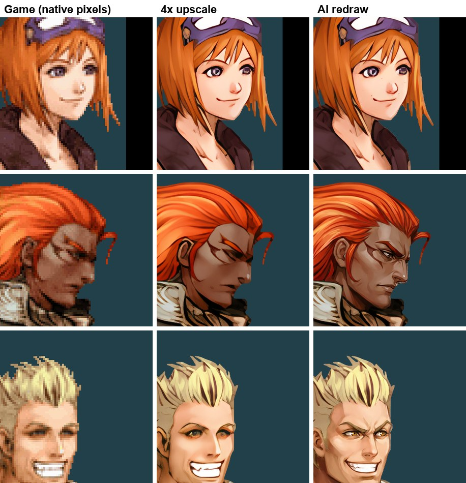
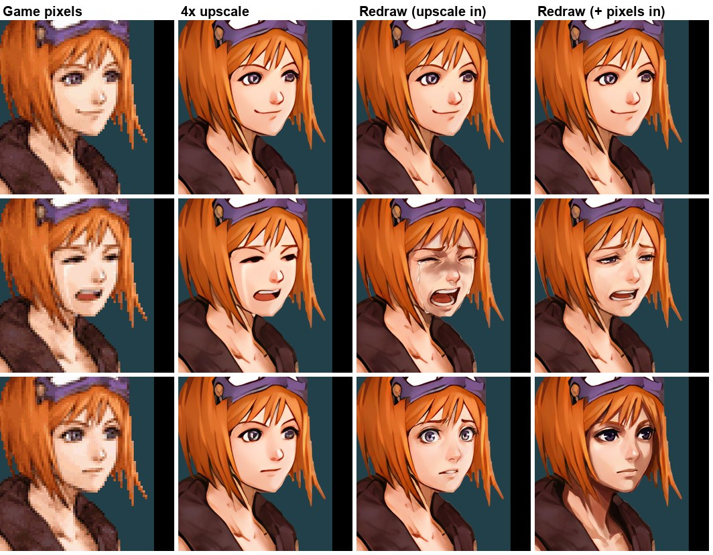

# AI redraws: fixing what an upscaler can't

An upscaler sharpens the pixels a game has. A DS portrait is 128x160 pixels, so an eye is two
or three pixels, and no upscaler can know what it was meant to look like: eyes come out as slits
or smudges, mouths as blobs. `redraw.py` sends the upscaled portrait, plus the game's official
character art as a reference, to an image model and asks for the same painting drawn cleanly:
same framing, pose, colours and expression, with the eyes, mouth and small details redrawn.



*Lufia: Curse of the Sinistrals on the AYN Thor: Tia, Gades and Guy. Left: the game's own
pixels. Middle: the 4x upscale the pack used before. Right: the AI redraw.*

This page is the whole method, with what worked, what didn't and what it cost on Lufia, so you
can do the same for your favourite game.

## What you need

- A pack for the game from `hd_remaster.py` (extract, upscale, build). Redraws replace images in
  it; everything else stays as it was.
- An [OpenRouter](https://openrouter.ai) account with a few dollars of credit. Put the key in
  `tools/hd_remaster/.env` as `OPENROUTER_API_KEY=sk-or-...`. Git ignores that file; never put
  a key anywhere else in the repository.
- **Reference art** for each character: the game's official illustrations. For Lufia they are
  on Creative Uncut (character designer Yusuke Naora). Save them to `work/<CODE>/refs/`; they
  belong to the publisher and stay out of the repository. `games/<CODE>/redraw.json` records
  where they came from and which character uses which file.

## Cost

About $0.14 per portrait with `google/gemini-3-pro-image`, plus about $0.002 per automatic
check. Lufia's 229 portraits, including every experiment below, came to $26.62. Done the way
this page recommends it would be about $35-40 for the whole cast (one call per portrait plus
retries), or a few dollars for the main characters. `--budget` stops any run before the game's
ledger (`work/<CODE>/redraw/ledger.jsonl`) passes it.

## The workflow

All commands run from `tools/hd_remaster` with the venv's python.

**1. Pick a model on one portrait.** `redraw.py models` lists the image models;
`redraw.py try work\<CODE> <key> --models a,b,c --ref work\<CODE>\refs\x.jpg --name X` runs one
portrait through several and writes a side-by-side sheet. On Lufia `google/gemini-3-pro-image`
won clearly: correct anatomy, kept the character's own markings, and its output lines up with
the game's image. `gemini-3.1-flash-image` (half the price) invented details;
`gpt-5.4-image-2` answered in a square, didn't line up, and cost twice as much.

**2. Redraw a character.**

```
redraw.py portrait work\BSDE --match talk_f_tear_ --name Tia --ref work\BSDE\refs\tia.jpg --auto-hint --verify
```

- The **master** expression (`normal`) is redrawn first; every other expression is an edit of
  the master, so the character's body and clothes stay identical between expressions. Only
  where the game's own expression differs from the master (the face, grown a little and
  softened) comes from the expression's redraw.
- `--with-native` also sends the game's own pixels, enlarged without smoothing. Not recommended
  yet: see [Giving it the pixels too](#giving-it-the-pixels-too).
- `--auto-hint` has a cheap vision model describe the game's face in words (eyes, eyebrows,
  mouth, eye colour) and puts that in the prompt. The game's expression names mislead image
  models: Lufia's "amazed" is an exasperated wince, and the name alone got wide-eyed surprise.
- `--verify` compares each result with the game's face (same vision model), redraws it once if
  the expression, eyes or eye colour differ or something is malformed, and leaves the game's
  upscale in place if it fails again.
- A character whose expressions come in different sizes or poses (a second outfit) needs one
  master per set: `--master mnormal --only mamazed,msmile`.

**3. Check everything.** `redraw.py check work\<CODE>` runs the same comparison over every
redrawn portrait and writes `work/<CODE>/redraw/check.json`. Then look at the flagged ones
yourself: the checker reads blurry native eyes as "half-closed" and calls a close match
"not the same expression" fairly often. Accept a good one by copying it into
`work/<CODE>/redrawn/assets2d/`; redo a bad one with `--only <expr>` and, if the model keeps
missing, a written `--hint "<expr>=eyes closed, mouth wide open, ..."`.

**4. Build and install.** `hd_remaster.py build` uses `work/<CODE>/redrawn/` wherever it has an
image and the upscale everywhere else; `push` installs the pack. Restart the game to see it.
Look at every character in the game before calling it done.

## Giving it the pixels too

The model's main input is the 4x upscale, because it can read features in it, but the upscale
carries the upscaler's guesses and the model builds on them. The obvious idea is to send the
game's own pixels as well (`--with-native`, enlarged without smoothing and marked as the truth
for colours and open or closed eyes). On Tia it was mixed:



*Rows: normal, cry, tension. Third column: from the upscale; last column: with the pixels too.*

The pixels calmed the exaggeration (the crying face stopped wailing), but at full size the eyes
were wrong: her crying eyes, closed in the game, came out open and looking down, and her tense
face got near-black eyes with heavy lashes instead of her purple ones. The automatic check
passed both, reading the closed eyes as half-closed. So the upscale alone, plus looking at every
result, stays the method; `--with-native` is there for experiments. Judge eyes at full size:
at thumbnail size these looked better.

## How a redraw fits the game exactly

- The model sees the art on flat grey, and its answer is aligned back onto the upscale (a
  scale search plus phase correlation of the edges). The redraw is then cut out with the
  upscale's own alpha, so the outline stays the game's and the art drops into the pack in place.
- Soft edge pixels take the colours of the solid pixels inside, not the model's grey; grey the
  model left inside the outline (hair that sweeps further in the game's image) is filled from
  the upscale.
- Gemini is told the output shape (`image_config.aspect_ratio`), or it may answer in a
  reference image's shape instead.

## What didn't work

Save yourself the money:

- **Four expressions per call** (a 2x2 sheet of faces) costs a quarter as much, but a third of
  Lufia's results failed the check: eye colours changed (Selan grey to blue, Tia purple to
  orange), expressions drifted (a closed-eye smile became a wink), and when the model
  rearranged a sheet the faces landed in the wrong place and left seams. One call per portrait
  is worth it.
- **Letting the model repaint bodies and armour.** It paints them softer than the upscale, and
  Gades' armour looked smeared. His portraits now blend the redrawn head over the upscaled
  armour (`work/BSDE/redraw/full_redraws` keeps the full versions).
- **Redrawing a logo with lettering.** The title logo's subtitle came back with a noisy chrome
  bevel and read worse than the upscale; Lufia keeps the upscaled logo.
- **Naming the expression in the prompt** instead of describing it (see `--auto-hint`).
- **Trusting the pipeline without looking.** Every problem above was found by playing the game
  or by the check, not by the numbers the tool prints.

## Adding your game

1. Build a normal pack, play a little, and pick the art that most needs it (portraits first).
2. Collect official art for the main characters into `work/<CODE>/refs/`, and write
   `games/<CODE>/redraw.json` (display names, reference files, where they came from).
3. `try` one portrait with two or three models; start with `google/gemini-3-pro-image`.
4. `portrait --auto-hint --verify` one character, look at it in the game, then do the rest.
5. `check`, look at what it flags, fix, build, push, play.
6. Add a before/after image to the game's README (`beforeafter.py`) and a line to
   [GAMES.md](games/GAMES.md).

## Fades

A portrait that fades in or out is drawn by the game blended with what is behind it. The
emulator used to keep the game's own pixels for those frames and add only the HD art's detail,
so a redraw whose eyes or mouth moved a little showed as the pixelated original during the fade
and popped to the redraw at the end. Since `557a8f21` the fading portrait is the HD art itself,
blended exactly as the game blends its own pixels.
