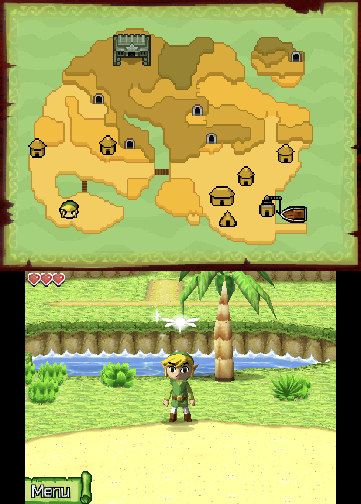
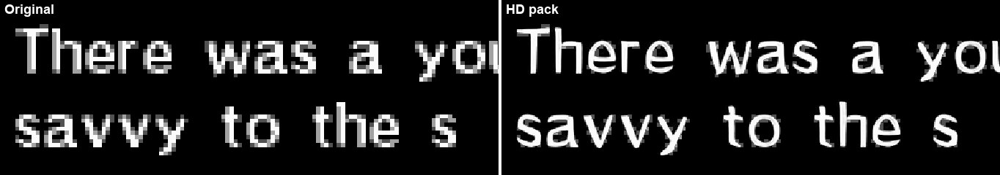

# The Legend of Zelda: Phantom Hourglass (AZEE)

```
powershell -ExecutionPolicy Bypass -File tools\hd_remaster\remaster.ps1 "Phantom Hourglass.nds" -Push
```

1934 textures, 4608 sprites and 7811 background tiles at 4x, built in about 23 minutes on an
RTX 3060. Installed with the HD Link model and the camera profile: a 168 MB ASTC zip (14,565
images).

## In game



Mercay Island, live on the AYN Thor (top screen over bottom screen, PNG): HD 3D textures and
sprites, the island map's BG tiles, and the AI-built HD Link model.

## Before / after




AYN Thor at 4x internal resolution, the same frame of a save state with the pack off and on.

Everything is stored as standard Nitro files, so no game-specific reader or rule is needed, and
1773 of the 1934 textures are paired with their palettes through the models' own materials.

## Not verified yet

The keys haven't been checked against textures dumped during play. To help, play a while with
texture dumping on, pull `files/texturedumps/AZEE` from the device and run:

```
tools\hd_remaster\.venv\Scripts\python tools\hd_remaster\hd_remaster.py verify tools\hd_remaster\work\AZEE --dumps <dumps>\textures --sprites <dumps>\sprites
```

Only the D-pad patched USA ROM has been tried. Run the retail ROM and compare the counts that
`extract` prints with the recipe's baseline.
