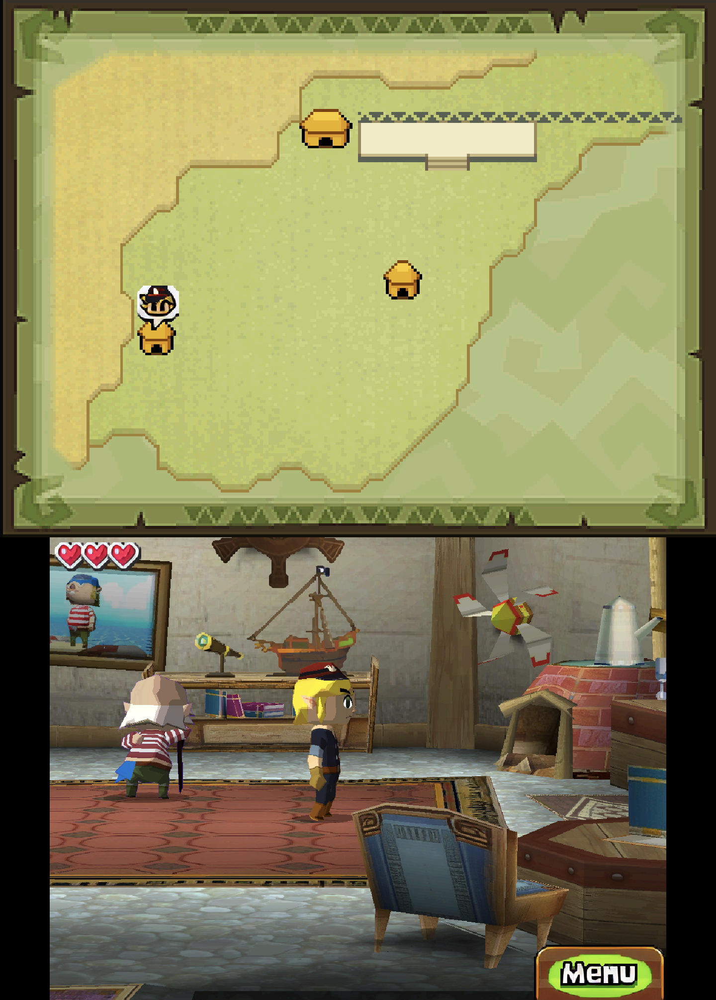

# The Legend of Zelda: Spirit Tracks (BKIE)

```
powershell -ExecutionPolicy Bypass -File tools\hd_remaster\remaster.ps1 "Spirit Tracks.nds" -Push
```

3156 textures, 5422 sprites and 21424 background tiles at 4x, upscaled in about 23 minutes.
Installed: a 200 MB ASTC zip (30,006 images; 438 MB as PNG), with the camera profile below.

## In game



Niko's house at the start of the game, live on the AYN Thor (top screen over bottom screen, PNG):
the HD map above, and the room seen from behind Link below.

## Behind-Link camera

[camera.txt](camera.txt) turns the emulator's free camera on for this game, with Phantom
Hourglass's values (same engine): low behind Link, swinging round behind him as the D-pad walks
him (the ROM is the D-pad patched one); the right stick turns, tilts and zooms on top, R3 resets.
Checked 2026-10-03 in Niko's house: the view follows Link left, right and up; walking down keeps
the view, so Link faces the camera. Looking out past a room's walls shows black, where the game
draws nothing. The train, towns and dungeons are not checked yet.

## Before / after


AYN Thor at 4x internal resolution, the same frame of a save state with the pack off and on.

Same engine family as Phantom Hourglass: everything is stored as standard Nitro files in NARC
archives, so no game-specific reader or rule is needed. Most textures are paired with their
palettes through the models' own materials, plus each material palette's animation family (the
blink swaps `zeld_eye1` for `zeld_eye2` and `zeld_eye3`). The four NFTR fonts (dialogue, credits and
the name font) are packed for HD text.

## Faded palettes stay native

The opening fades in from darkness by rewriting palettes. A pack key hashes the palette, so a
texture drawn with a faded palette has no key and stays native until the palette is back to
normal. On the opening, 196 of 200 logged texture misses were this.

## Not verified yet

The keys haven't been checked against textures dumped during play, and in-game dumping is no
longer used; check on the device instead with the `HDTexPack[Stats]` hit counts while playing.

Only the D-pad patched USA ROM has been tried. Run the retail ROM and compare the counts that
`extract` prints with the recipe's baseline.
