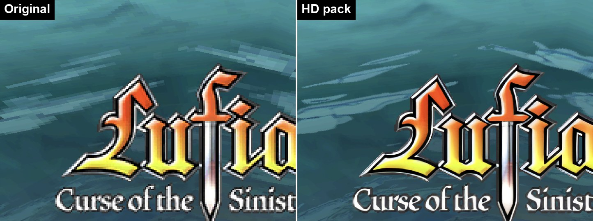
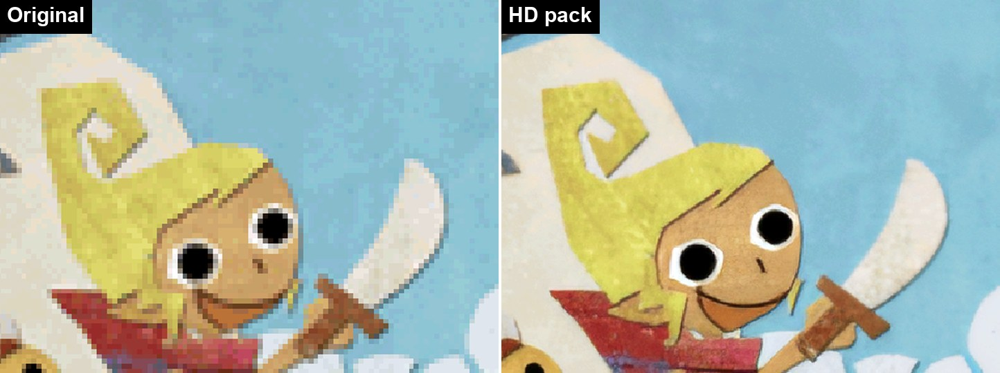
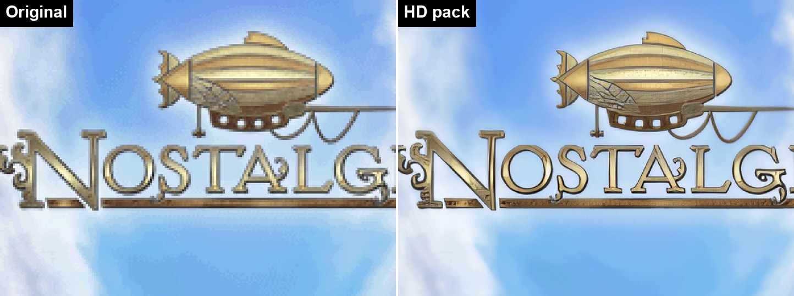
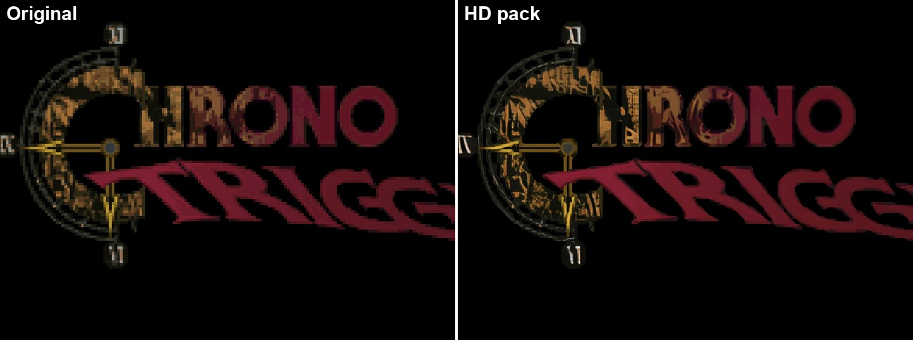

# Games with HD pack recipes

Every game `hd_remaster` has a recipe for, and the games wanted next. Each name links to that
game's README: the one command, what the pack covers and what it doesn't, what was verified,
and notes on how the game stores its graphics.

How to build a pack from a recipe, and how to add a game: [README.md](README.md). How the tool
works: [../README.md](../README.md). Packs only work in this fork.

Build times are for the upscale PC used so far: an RTX 3060 12 GB. Screenshots are from the AYN
Thor at 4x internal resolution, the same frame of a save state with the pack off (left) and on
(right).

## Recipes

| | Game | Status | Pack | Build time | Coverage |
| --- | --- | --- | --- | --- | --- |
|  | [Lufia: Curse of the Sinistrals](BSDE/README.md) BSDE, USA | **In progress** | 632 MB 37,419 images | ~20 min | 3D textures, sprites, BG tiles and the dialogue font; 180 of 229 character portraits AI-redrawn from the official art ([how](../REDRAW.md)). 181/223 textures and 324/587 sprites dumped in play reproduced, all pixel-identical; the rest are built at runtime. Played on the Thor: intro, title, first town. |
|  | [The Legend of Zelda: Phantom Hourglass](AZEE/README.md) AZEE, USA (D-pad patch) | **In progress** | 309 MB 14,559 images | ~23 min | Title logo, storybook pages and text, BG tiles (92160/92160 lookups hit), sprites and 3D textures. Played on the Thor: title and prologue. |
|  | [The Legend of Zelda: Spirit Tracks](BKIE/README.md) BKIE, USA (D-pad patch) | **In progress** | 366 MB 30,006 images | ~23 min | Textures, sprites, BG tiles (92160/92160 on the opening), four fonts. Textures drawn with a faded palette stay native until the fade ends. Played on the Thor: opening demo. |
|  | [Nostalgia](CJKE/README.md) CJKE, USA | **In progress** | 1.2 GB 240,438 images | ~35 min | 3D textures, sprites, the painted screens and world map, two fonts. Played on the Thor: painted intro (BG 91080/92160), title and main menu (92160/92160). |
|  | [Chrono Trigger](YQUE/README.md) YQUE, USA | **In progress** (sprites only) | 412 MB 54,754 images | ~45 min | Character sprites, menus, effects, world map objects. Field and town backgrounds are not covered: their layouts come from SNES-style chip and map tables the tool can't read yet. Played on the Thor: title (logo sprites 2580/2640). |

**Status**: *Finished* - the pack is built, played on the Thor across the game, and the README
has measured times. *In progress* - the pack works, but only part of the game has been checked.

## Wishlist

Games wanted next, not started. All of them run at 60 fps on the Thor (45 s intro recordings of
both screens, 2026-09-24).

| Game | Known so far |
| --- | --- |
| Lost Magic | |
| Rosario + Vampire | |
| Rummikub | |
| Pokémon Black Version 2 | The bottom screen stays black through the intro and title, as on the software renderer. |
| Professor Layton and the Last Specter | |
| Metroid Prime Hunters | A green flash in the intro was fixed in the renderer (`efa48310`). |
| Mario Slam Basketball | |
| Mega Man ZX | A flash on the fade after the Actimagine logo was fixed in the renderer (`a1c27927`). |
| Lunar Knights | |

## Checked, not a candidate

Games whose graphics turned out not to be buildable from the ROM, with the reason, so nobody
repeats the work. Nothing here yet.

| Game | Code | Why not | Checked |
| --- | --- | --- | --- |

## Adding a row

A game gets a row here when its recipe folder exists (`games/<CODE>/` with `recipe.json` and a
README). Put a before/after image from the game's `media/` in the first column (see
[README.md](README.md#screenshots)), the pack size and image count from `build`'s output, and
the upscale time from its log. A game checked and dropped goes in the last table instead, with
what was found.
