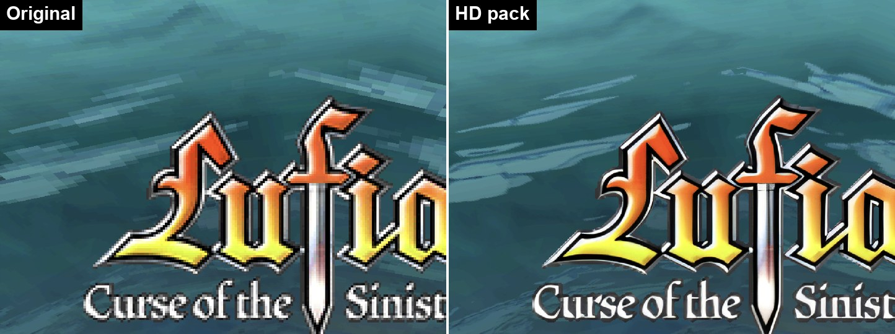
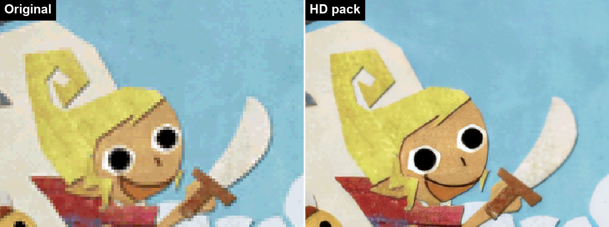
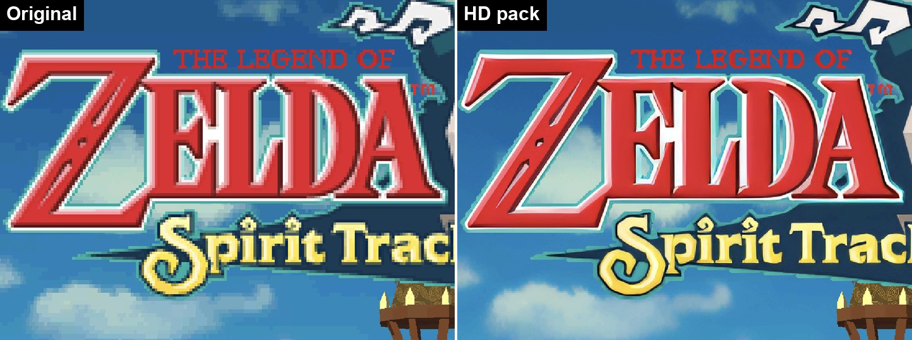
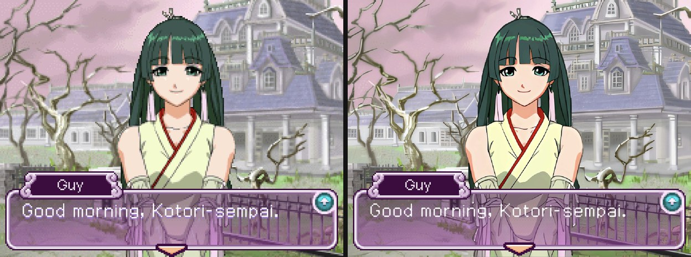
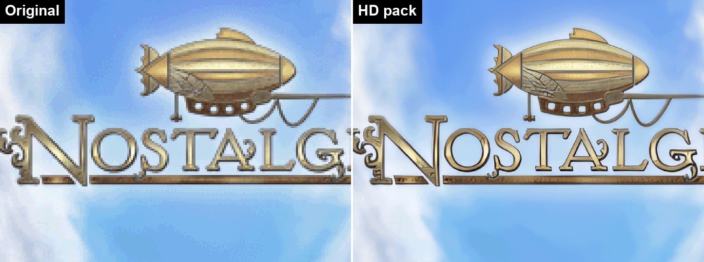
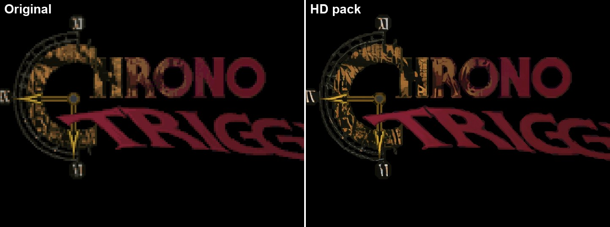

# Games with HD pack recipes

The build status of every game `hd_remaster` has a recipe for (the Remaster Studio reads the
table below). Everything the emulator does for a game - HD pack, AI redraws, 3D models, camera,
widescreen codes, rendering fixes - and the games wanted next are listed per game in
[Game enhancements](../../../game-enhancements/README.md).

Each name links to that game's recipe README: the one command, what the pack covers and what it
doesn't, what was verified, and notes on how the game stores its graphics.

How to build a pack from a recipe, and how to add a game: [README.md](README.md). How the tool
works: [../README.md](../README.md). Packs only work in this fork.

Build times are for the upscale PC used so far: an RTX 3060 12 GB. Screenshots are from the AYN
Thor at 4x internal resolution, the same frame of a save state with the pack off (left) and on
(right); each game's README also shows the pack in game, as PNG.

Pack = the installed pack: one zip of ASTC 4x4 images (the pack format since 2026-10-03, see
[../README.md](../README.md#pack-format-astc-in-a-zip-the-standard-from-2026-10-03)), about half the size of the PNG folders it replaced.

## Recipes

| | Game | Status | Pack | Build time | Coverage |
| --- | --- | --- | --- | --- | --- |
|  | [Lufia: Curse of the Sinistrals](BSDE/README.md) BSDE, USA | **In progress** | 413 MB zip 54,710 images | ~20 min | 3D textures, sprites, BG tiles and the dialogue font; 180 of 229 character portraits AI-redrawn from the official art ([how](../REDRAW.md)). 181/223 textures and 324/587 sprites dumped in play reproduced, all pixel-identical; the rest are built at runtime. Played on the Thor: intro, title, first town. |
|  | [The Legend of Zelda: Phantom Hourglass](AZEE/README.md) AZEE, USA (D-pad patch) | **In progress** | 168 MB zip 14,565 images | ~23 min | Title logo, storybook pages and text, BG tiles (92160/92160 lookups hit), sprites and 3D textures. Played on the Thor: title and prologue. |
|  | [The Legend of Zelda: Spirit Tracks](BKIE/README.md) BKIE, USA (D-pad patch) | **In progress** | 200 MB zip 30,006 images | ~23 min | Textures, sprites, BG tiles (92160/92160 on the opening), four fonts. Textures drawn with a faded palette stay native until the fade ends. Played on the Thor: opening demo. |
|  | [Rosario + Vampire: Tanabata no Miss Youkai Gakuen](YVLJ/README.md) YVLJ, Japan (English patch) | **In progress** | 288 MB zip 108,113 images | ~6 min | Backgrounds, event CGs, menus (88,955 BG tiles) and character portraits (2,796 sprite pieces) from the game's own BBG and BAC formats. 994/1000 BG tiles and 41/41 character sprites drawn in play are pack keys. Menus, text window, name plates and buttons: 11,800 16-colour sprite pieces. Dialogue text HD through the game's converted font. Played on the Thor: title, a dialogue scene. |
|  | [Nostalgia](CJKE/README.md) CJKE, USA | **In progress** | 692 MB zip 240,438 images | ~35 min | 3D textures, sprites, the painted screens and world map, two fonts. Played on the Thor: painted intro (BG 91080/92160), title and main menu (92160/92160). |
|  | [Chrono Trigger](YQUE/README.md) YQUE, USA | **In progress** (sprites only) | 142 MB zip 54,754 images | ~45 min | Character sprites, menus, effects, world map objects. Field and town backgrounds are not covered: their layouts come from SNES-style chip and map tables the tool can't read yet. Played on the Thor: title (logo sprites 2580/2640). |

**Status**: *Finished* - the pack is built, played on the Thor across the game, and the README
has measured times. *In progress* - the pack works, but only part of the game has been checked.

## Adding a row

A game gets a row here when its recipe folder exists (`games/<CODE>/` with `recipe.json` and a
README). Put a before/after image from the game's `media/` in the first column (see
[README.md](README.md#screenshots)), the pack size and image count from `build`'s output, and
the upscale time from its log. Give the game a page in [Game
enhancements](../../../game-enhancements/README.md) too; a game checked and dropped goes in that
page's "Checked, not a candidate" list, with what was found.
