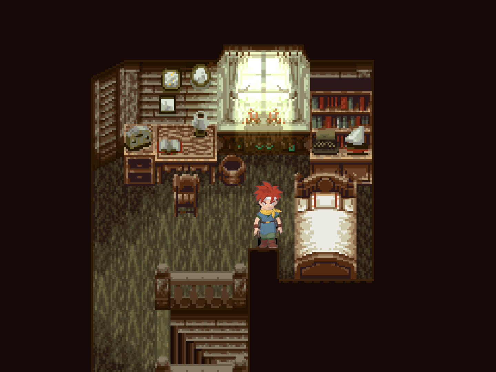
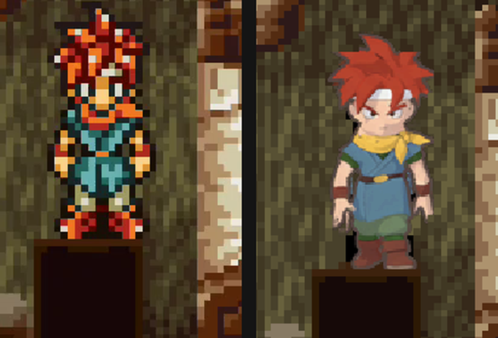

# Chrono Trigger (YQUE)

```
powershell -ExecutionPolicy Bypass -File tools\hd_remaster\remaster.ps1 "Chrono Trigger.nds" -Push
```

Sprites only: 26,368 sprite images (most of them the character sheets under `Chara/`), cut into
103,503 pack keys at 4x (48,671 of them colour keys, see below): a 260 MB ASTC zip installed.

## In game



New game, Crono's room, live on the AYN Thor (PNG; top screen only: the Thor's dual-screen
assistant panel covered the bottom one during the capture). Crono is the 3D test below; the room
is a field background, which the pack doesn't cover yet.

## Character sprites in the field

Two things kept the field sprites native until 2026-10-03, found by playing a new game:

- **Party palettes carry extra colours.** In the field the game fills the unused slots 13-15 of
  Crono's palette (ObjPlt_0000) with other colours. A 16-colour key hashes all 16, so it never
  matched. The recipe now gives the `Chara/` sheets colour keys (the colours the sprite shows),
  which the emulator looks up when the byte key misses.
- **NPCs share palettes.** Sheets are paired with the palette of the same number, but the game
  picks an NPC's palette itself, like the SNES original: sheets 20, 44 and 47 are drawn with
  ObjPlt_0009, 66, 182 and 183 with 0161, 127 and 157 with 0136. No table in the ROM holds this
  (ARM9, overlays and `PS_BIN` searched); the location scripts (`PS_BIN/Atel/*.dat`) most likely
  name it per NPC. The pairs seen in play are in the recipe (`pairs`); the rest of the NPCs stay
  native until the scripts are read or more pairs are collected in play.

## 3D Crono (test)



A test of [HD sprites from a 3D model](../../README.md#hd-sprites-from-a-3d-model-animated-characters)
(`chara3d.py`): a Toriyama-style turnaround of Crono drawn by Gemini from his sprite and the
official art, a Tripo model rigged with idle, walk and run clips, rendered cel-shaded in Blender.
26 of the 28 standing, walking and running cells use it ($0.14 + 95 Tripo credits).
Left to do: the dash frames (cells 11 and 14; the run clip doesn't fit the game's long stride),
a few walk frames that mix a 3D body with an upscaled head (the game builds frames from pieces
some cells share), battle and story poses, and the scale (the render is about 15% shorter than
the sprite). The upscale took about 45 minutes on an RTX 3060. The game has
no 3D textures and no NFTR fonts.

## Before / after


AYN Thor at 4x internal resolution, the same frame with the pack off and on.

## Backgrounds are not covered yet

The fields and towns are the SNES game's maps. The tiles are in `Map/Bg/Bg_*_ncg.bin` and the
palettes in `BgPlt_*_ncl.bin` (11 rows of 16 colours), but there are no Nitro screen files: the
game lays each map out at runtime from `PS_BIN/ChipTable/*.dat` (16x16 chips, 3072 bytes each)
and `PS_BIN/MapTable/*.dat` (the maps, compressed). A 4bpp BG key includes the palette row, and
only the chip tables say which row each tile uses, so without parsing them the tool has no key
for any field tile. Parsing the chip tables would give both the palette rows and whole maps to
upscale in one piece.

## Verified

2026-09-24 on the AYN Thor: the title logo is sprites, 2580 of 2640 lookups hit. The anime
intro is a movie and the pendulum sequence and fields are BG, so they stay native.
