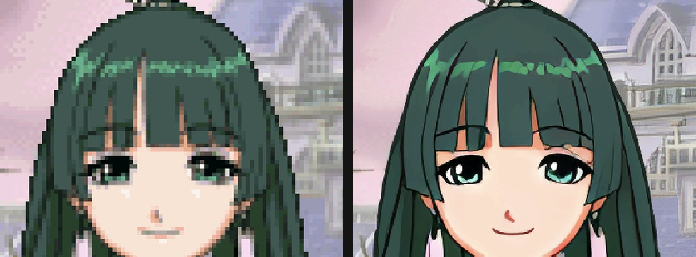
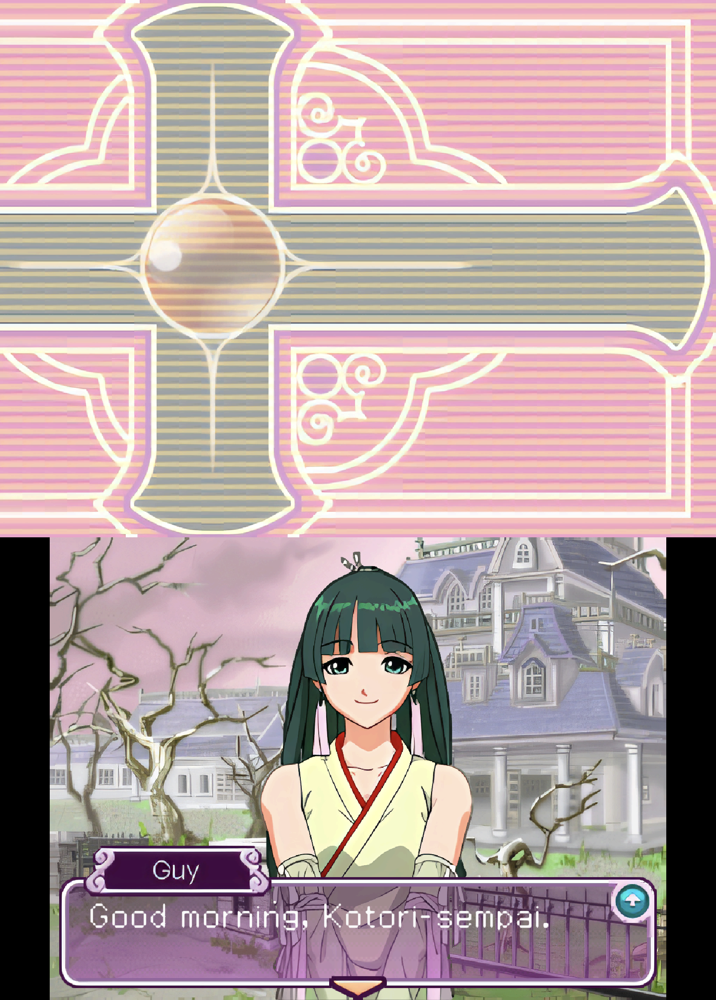
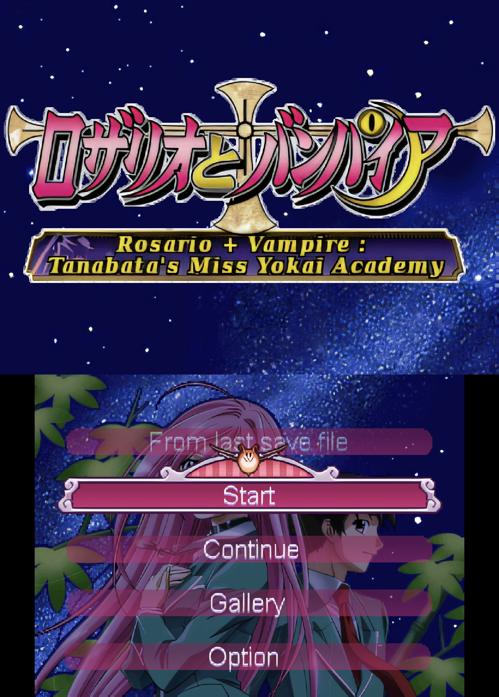
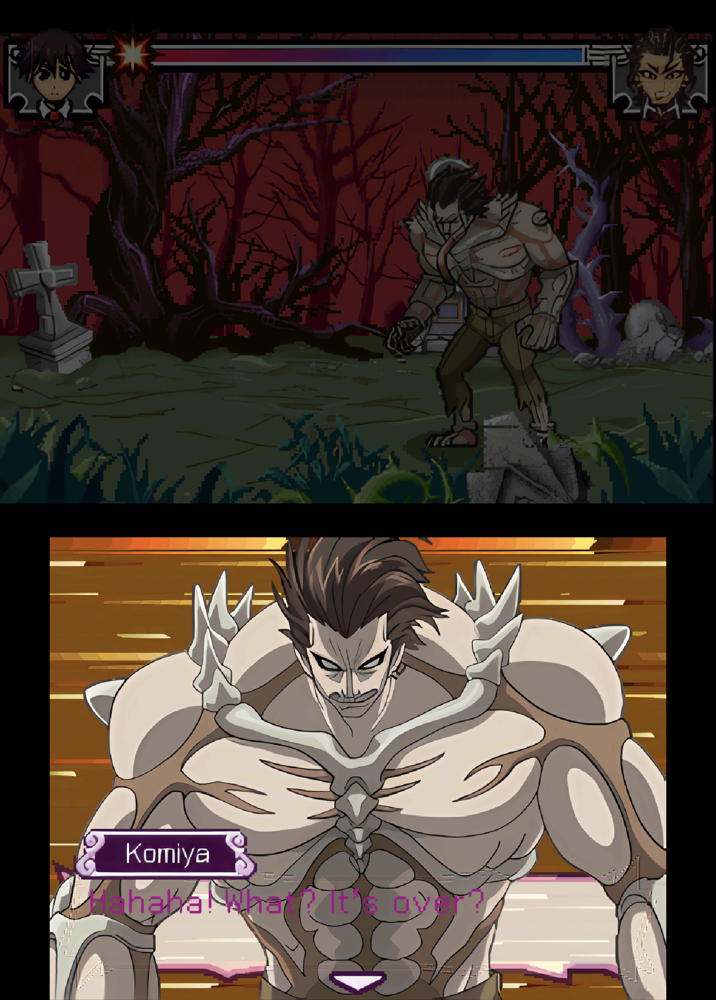
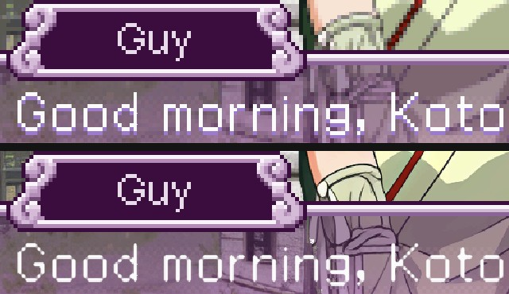

# Rosario + Vampire: Tanabata no Miss Youkai Gakuen (YVLJ)

Japan, with jjjewel's English translation patch v1.0 (sha256 in [recipe.json](recipe.json)).
A visual novel by Capcom (Dimps): painted backgrounds and character portraits.

```
powershell -ExecutionPolicy Bypass -File tools\hd_remaster\remaster.ps1 "Rosario to Vampire Tanabata no Miss Youkai Gakuen (English Patched v1.0).nds" -Push
```




Installed: a 288 MB ASTC zip (108,113 images; 631 MB as PNG).

## In game

Live on the AYN Thor with the pack (top screen over bottom screen, PNG):







## What the pack covers

- **Backgrounds, event CGs, title and menu screens**: 197 pictures, 93,525 BG tile keys,
  4x-UltraSharp, with the palette-animation frames of the battle and minigame backgrounds.
- **Character portraits**: 2,796 sprite pieces (upper body, lower body, eye and mouth frames of
  every character, in both palettes each character has), Real-ESRGAN x4plus_anime_6B.
- **Menus, the text window, name plates and buttons**: 11,800 16-colour sprite pieces (the title
  screen's prompt, menus, minigames), 4x-UltraSharp with the model's own soft edges: the default
  cut-out kept the pixel outline of the thin menu text, which showed most on the see-through
  (blended) menu items.
- **Dialogue text and names**: the game's `#FNT` font (3,387 glyphs) converted to NFTR, so the
  emulator's HD text recognises the glyphs it draws into sprites and redraws them. It is a
  1-pixel pixel font (fill shade 1, accent pixels shade 2): its HD glyphs are drawn from the fill
  mask, smoothly sampled at 4x with soft edges, not upscaled by a model (one turned the grey
  strokes into hollow outlines, and closed the gap between an i's dot and its stem).



Not covered: one 16-colour piece (`fix_up.bac`) the game draws with a palette that isn't in its
file.

The logos, the opening pictures and the title came out native until an emulator fix
(2026-10-03): the game leaves an alpha blend at full strength (EVA 16, EVB 0) on every picture and
a brightness fade at 0 after its logos fade in. Neither changes a pixel, but the 2D renderer
marked those pixels as blended, which HD replacement leaves alone. Now such a blend or fade keeps
the pixel as it is.

## How the game stores its graphics

No standard Nitro graphics files. Everything sits in `.bb` archives (`BB` + count + offset/size
pairs) and NARCs:

- **BBG** pictures ([bbg.py](../../bbg.py)): a header with the bit depth, size in tiles and, for
  16-colour pictures, the palette row the palette is uploaded to (the map counts rows from
  there), then three sections, each LZ10 or stored: tiles, a DS screen map, a palette. The game
  shows most as 256-colour text BGs with extended palettes, which is what the BG keys hash.
- **#BPA** palette animations ([bbg.py](../../bbg.py)): frames of colours the game cycles through
  part of a picture's palette (the battle's bottom screen). Each frame is another palette the
  tiles are keyed with; a section pairs with the picture whose own colours are one of its frames.
- **BAC** sprite animations ([bac.py](../../bac.py)): records naming a frame and, per piece, a
  pixel chunk; frames as OAM attributes with a corner relative to the character's anchor; two
  256-colour palettes (menu, window and button BACs: 16-colour palettes in 36-byte blocks); chunks
  that go to OBJ VRAM unchanged (1D mapping). A character is four
  BACs in one archive entry: `up`, `down`, `eye`, `mouth`. Every frame is upscaled drawn over
  the whole body (first upper- and lower-body frames, placed by the anchor), so eyes, mouth and
  waist join without a seam.
- **#FNT** font ([fnt.py](../../fnt.py)): 3,387 glyphs, 16x16 at 4 bpp, each LZ10-compressed,
  2x2 tiles of 8x8; only shades 0-2 in use, so the converted NFTR is 2 bpp.

## Verified

On the Thor (2026-10-02), with a one-image probe pack logging every tile the game drew: 994 of
the first 1000 BG tiles of the title screens and all 41 256-colour sprites of a dialogue scene
(Kotori: body, eyes, mouth, plus another character) are keys the extraction made. With the pack:
the scene's BG lookups 92,160 of 138,240 hit (the rest are the text window), the portrait is HD,
eyes and mouth join the face without a seam, and the HD text recognises all 26 glyphs of "Good
morning, Kotori-sempai." (and the next lines, and the name in the name plate).

2026-10-03, played into the first battle (minigame): two tool bugs found and fixed. 23
16-colour pictures (the battle foreground and floor, prompts, gauges, menu backgrounds) were
keyed with the wrong palette rows (the upload base was ignored), and the battle's bottom screen
cycles its palette (#BPA): both layers now hit every tile in a battle snapshot. Story scenes,
the school map (morning, evening) and the sepia flashbacks hit every non-blank tile. Left
native: see-through menu items and choices (a real alpha blend the renderer composes on the
CPU), runtime-built 3D textures in a few transitions.

2026-10-03, booted from the start: the Capcom and Dimps logos, the opening pictures and the title
are HD; the title screen's sprites hit 420 of 420; 51 of the 53 16-colour sprite misses logged
in play (text window, name plates, buttons) are pieces the extraction now makes. The dialogue
scene's text window frame, name plate and scroll button are HD.
